# How to use GIT in IDA

This is a short introduction to Git in the iGRC context.  
So: the bare minimum to working with your colleagues on projects where git is required.  

> This assumes that you are in an environment where each user has a workspace, and Git is already setup.  

## General concepts

Each user has a local (full) copy of the Git repository.  
There is often a central repository, on a share or a webserver somewhere that serves as a proxy for users; meaning you don't share your code directly to other users, but all go through this central git repository - often called **remote**.  

So, for the environments, we have:  

- `Local`: your machine  
- `Remote`: the central repository (or remote)

> We can ignore other users here (they simply have each their own local repository)

The git repository (being local or remote) is all contained within a hidden `.git` folder.  

In addition to the `git` repository, you have the usual **workspace**, where iGRC points to (where the project files are located).  
The workspace is what you see in the `Project explorer`:  
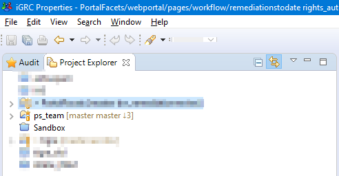  

> You can have multiple projects in your workspace (each with a different git repo associated, or within the same git repository)  

Files of the workspace live outside of the git repo, they won't be updated by git automatically or won't be changed by git automatically.  

> You will need to run some git actions to either update your workspace from git, or update git with your workspace

## Commands / Actions

Here are the most common actions (or commands):  

- `Add to index`: add **modified** files to the **staging** area, those files will be included in the next `commit`  
  - It is easy to remove the files from the index if you added them by mistake
- `Commit`: update **all** the files from the `index` to your local git repository, grouped together as a `commit`
  - It has no impact on the **remote** git repository yet, you will need to `push` for that  
  - If did a `commit` by mistake, it's too late: it will stay in the history (but you can *revert* it if needed)
- `Push`: update the **remote** git repository with your latest changes (or commits)  
  - You need to be *up-to-date* **before** you can push your changes
  - Alway `Pull` before you push so that you know your are up-to-date
- `Fetch`: retrieve to latest version from the the central (remote) git repository
  - This will only update your local git repo, it has no impact on your workspace
- `Pull`: this will run the `fetch` command, then update your workspace files with the latest version
  - Don't pull if your have modified files in your workspace
  - You need to replace modified files with the `head revision` or `commit` the chances first
  - If you have commits locally, the pull will add a new **merge** commit that merges your changes with the remote changes
- `Checkout`: this will switch from a branch (the current one) to another (the target)

## Recommendations

### Commit less, commit often  

What **not** to do: modify a lot of files not related to each other, and commit all modifications at once.  
This will make it harder to link the commit description (of what you did) to the modifications made in the files.  
If will also make it more likely to run into a conflict, and have to manually fix a large number of files.  

What you **should** do: make granular modifications, and make a commit for each.  
If your are fixing issues A, B and C, have a commit for each.  
If you are developing a new feature X, break it down into independent steps and do a commit for each.  

### Be up to date

Before you start working on something new (at the start of your day for instance), remember to **pull**.  
Also, when you are done with a feature or bugfix, push it to the remote.  
It will help prevent working on an outdated version, and avoid conflicts later on.  

## In iGRC

### Interfaces

There are different places in iGRC where you can interact with your Git repository.  

#### Menu

In the project explorer, right click on the project, and select the `Team` menu:  
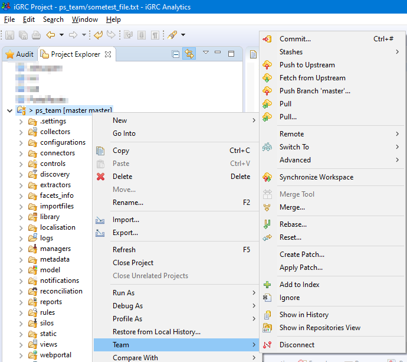  

#### Perspective

Open the `Git` perspective to add/remove git repositories.  
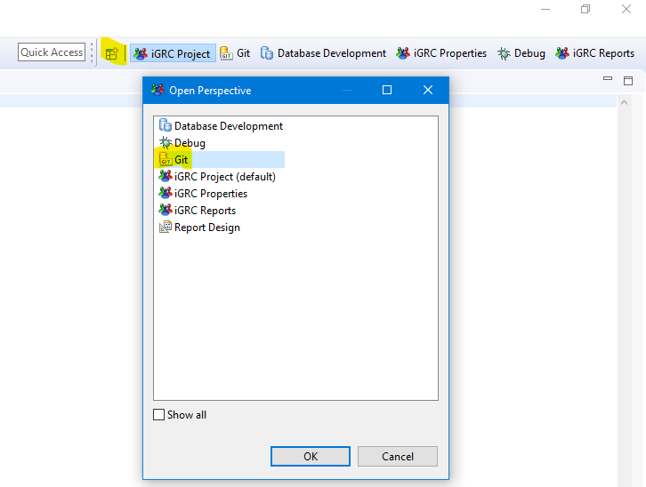  

#### Staging view

Add the `Git` staging view to commit your changes:  
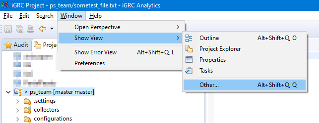  
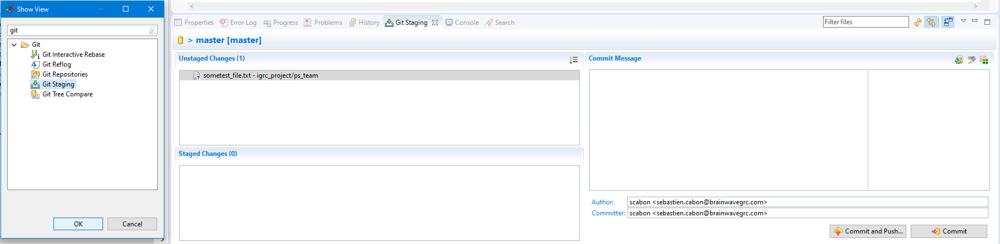  

### Modified workspace

If your workspace contains modified files, that are not yet committed to your git repository, the `Project explorer` will show a `>`:  
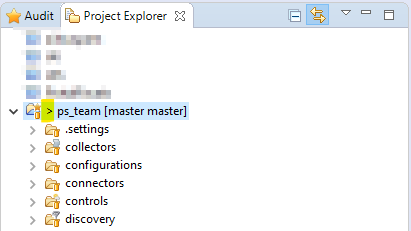  

### Fetch

Retrieve the latest commits from the central repository in you local repository:  
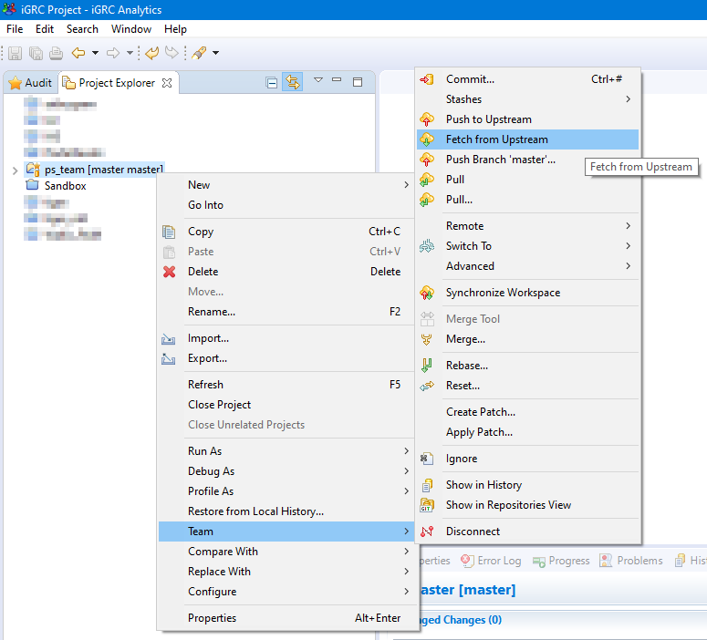.  

If there are pending changes (not yet applied to your workspace), the number of commits is shown next to a down arrow: `⬇ N`:  
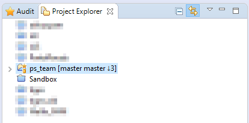  

> Here there are three commits in my repo that have not yet been applied to my workspace.  

### Stage changes

If there are modified files in your workspace that you want to commit, you will first need to select the files you want to add to the next commit, by adding them to the staging area (choose the `Add to Index` menu):  
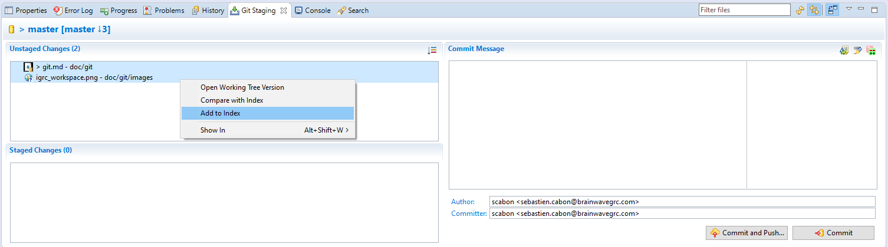  

If you made a mistake, you can remove the files from the staging are (choose the `Remove from Index` menu):  
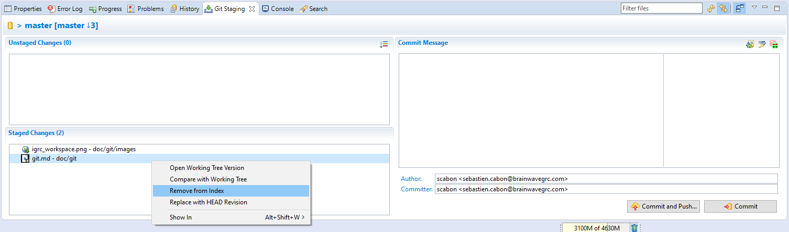  

### Commit

Once you have selected the files that make sens for a commit, simply add a commit message:  
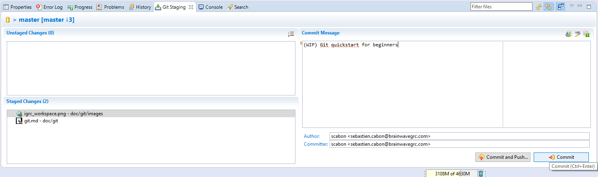  

> You have ~80 characters for your commit message
> You can add more information after a blank line

The commits your add to your repository that have not yet been pushed to the central repo will be shown with an up arrow and a number `⬆ N`:  
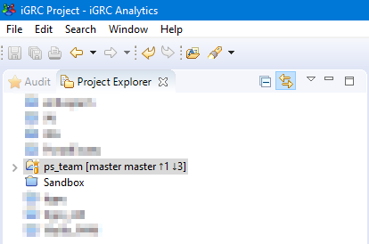  

> Here we have 1 commit in our local repo that has not been pushed to the remote repository
> And 3 commits from the remote repository waiting to be applied to our workspace

### Pull

Pulling will fetch the latest changes and update your workspace.  
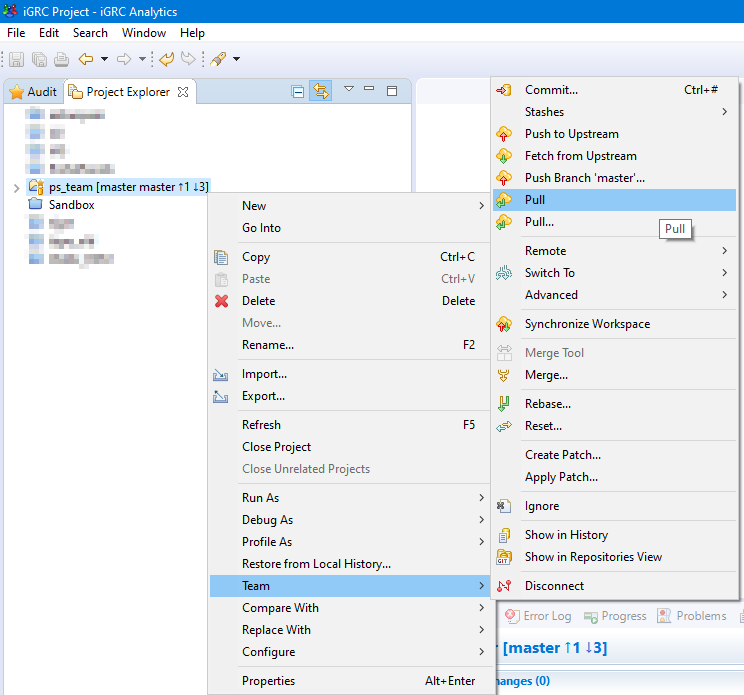  

If you have local commits (shown as `⬆ N`), the pull will try to merge your changes with the remote changes and add a new commit for this action (it will be updated to `⬆ N+1`).  

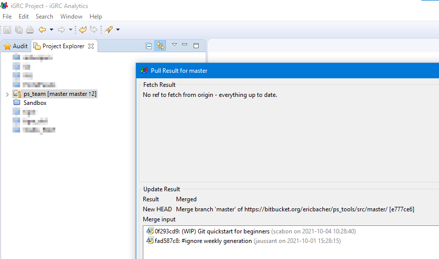  

> If the automatic merge is successful, one commit will be added; you still need to **push** your commits to the remote repository
> If it fails, you are probably in a **conflict** state, that you have to solve manually (not part of this introduction, call an expert).  

### Push

This will push your commits to the remote repository:  
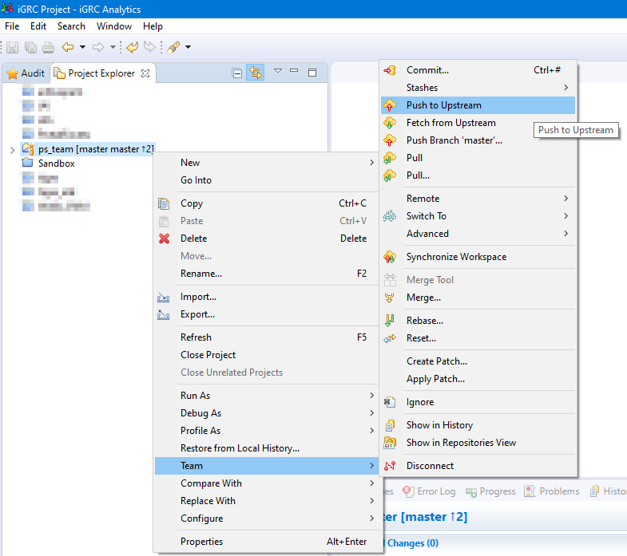  

The result should be that there are no more pending changes to your repository:  
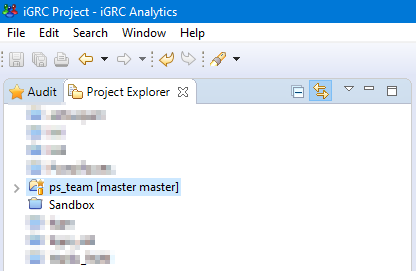  

> `⬆ 0 ⬇ 0` is hidden

### Checkout

This operation allows to switch from a branch to another one.

This operation should be done from the Git perspective. From it, you can see the current branch (the one with the  icon) and others branches that you can switch on.

In the below example, the current branch is `master` and we are trying to switch to the `develop` branch using the **checkout** command.

To do so, right click on the target branch and select `Checkout option`.

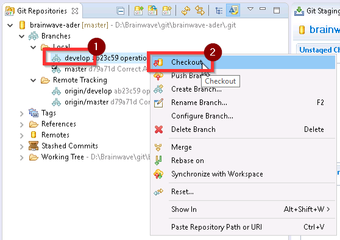

### Comparing files

When there is a conflict, the merge tool might show the whole files as different:  

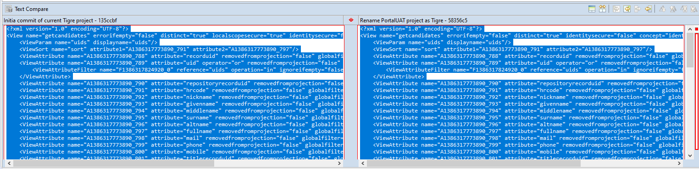  

You can click on the icon on the top right corner that says "three way compare":  

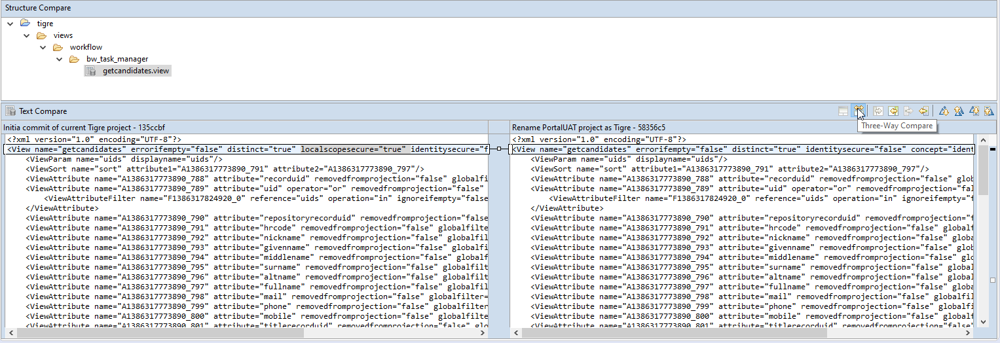  

This will make merging changes much easier!

### Restore a file from a previous commit

To retrieve an older version of a specific file from a previous commit, you can, from the Project Explorer, right-click on the concerned file and go to `Replace With -> Commit...` menu.

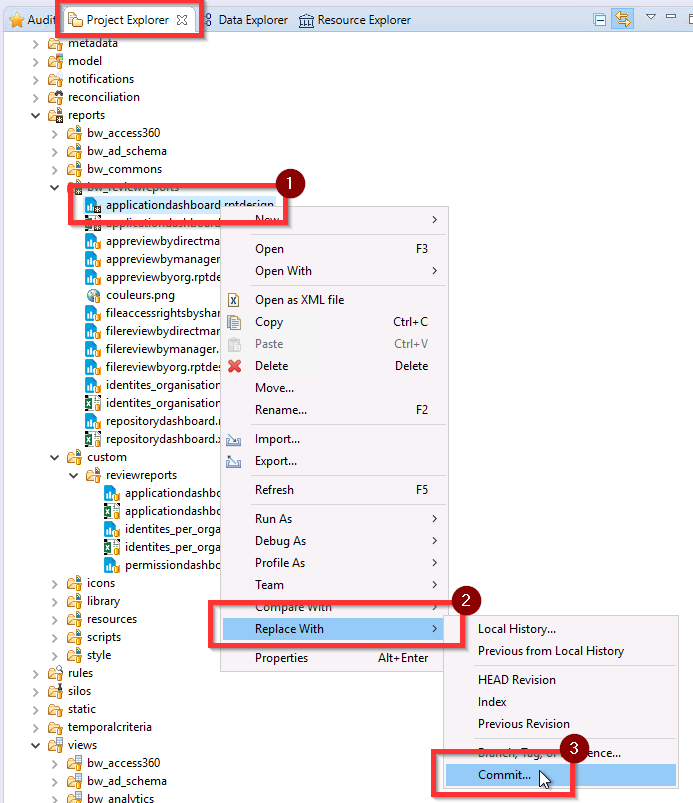

> Note: take care to do not have any untracked files before doing this manipulation.

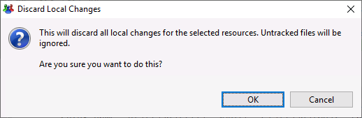

Then, select the commit from which you want to retrieve the file version.

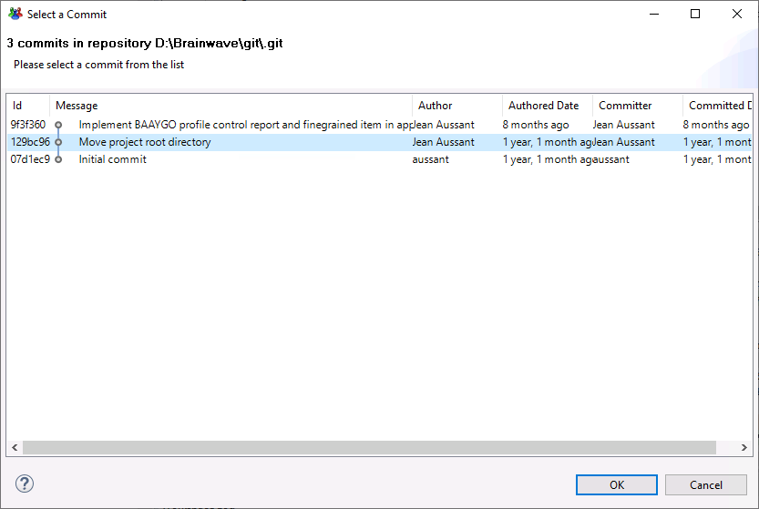

Finally, you can commit the change with this file modification (as a standard commit after a file modification).
