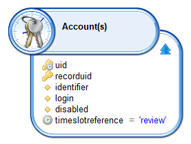
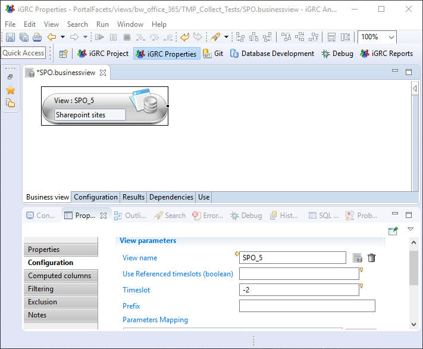

# Reference timeslots

In essence the product takes snapshots of user entitlements. These snapshots, called timeslots, are created on a regular basis (for example once a week or once a month).
This concept provides the opportunity to compare the information contained in different timeslots, monitor the changes or compute trends. Typically, trends use all previously collected timeslots.
However, there can occur some side effects during the analysis of data when using all available timeslots. For example, lets assume that a manager would like to see a graph showing the number of defects per month when the snapshots are made on a weekly basis.

## Objective

The objective of implementing reference timeslots is to dissociate the frequency of data loading from the frequency of data used for time-based analysis.  
There are at least 2 usages:  

- Event driven

Some snapshots may be more important than others because they contain the data used for a review or for the report generation for an audit. The other timeslots have no official meaning. They are used in a continuous data quality cleaning process or to check on a regular basis if the entitlements respects the security policy. In this use case, only the timeslots used for review or audit should be considered when computing differences with the current situation or when displaying trends.

- Continuous analysis

Even without specific events like audits or reviews, there is a need to follow trends and variations on a larger period. For example, if the data loading occurs once a week. We may consider selecting the first timeslot of each quarter to display a graph about the number of orphan accounts for the last 3 years.

## Solution

As of version 2017 R3, a new concept has been added to a timeslot: the reference type.
It works like a tag associated to the timeslot. Several timeslots can be changed to a reference timeslots.
The reference type is any string (up to 32 characters). The type has no meaning for the Identity Analytics product. The meaning is customer specific. The Identity Analytics product consider that a timeslot is a reference timeslot if the type is not empty, whatever value it contains.  

> [!warning] lease do **NOT** use the string `$$HEAD$$` as your reference timeslot string as this is a technical flag used in the product.

## Setting the reference type

A workflow process must be used to set the reference type of a timeslot. A Javascript method has been added to the 'workflow' object.

Here is the documentation:

`workflow.setReferenceTimeslot(timeslotUid, referenceType);`

- timeslotUid is a timeslot identifier. This value can not be empty or null. The timeslot UID should always be given as a parameter even if the timeslot is the current.
- referenceType is timeslot reference type. This value is interpreted at application level. Any value can be set as long as it is less than 32 characters. The product does not interpret this value but checks if it is empty or null to know if the timeslot is a reference timeslot.

One can use a variable modification component that calls a Javascript function. Here is an example to set the workflow timeslot as a reference timeslot :

```js
function setReviewTimeslot() {
      var /*String*/ wfTimeslot = workflow.timeslot;
      workflow.setReferenceTimeslot(wfTimeslot, 'review');
  }
```

## Searching for reference timeslot

The view editor adds a timeslotreference attribute in Account, Identity, Organisation, Asset, Application, Permission, Right, Usage, Group, Repository, SearchResult, ControlResult, ControlLog and ImportLog.  

By adding this attribute in the main concept, the timeslot criteria is disabled so the filtering on the timeslotreference attribute returns all the concepts in all timeslot with a given reference type...



## Using referenced timeslot in business view

When using business view you can configure a relative timeslot that will be calculated according to the timeslot passed to the businessview (ex: +2, -3), this feature can be parameterized in the configuration of different components (view source, union, join,trend)  



By default all timeslots are considered in the calculation of the relative timeslot.  

To consider only reference timeslots you have to pass  `true` to the boolean variable `Use referenced timeslot`.  

### Example

Bellow you will find a list of all collected timeslots and there type:

- The blue timeslots are reference timeslots
- The green timeslot is the one passed to the businessview
- The red timeslot is the current one  

<span style="color: blue">T1</span> --\> T2 --\> <span style="color: blue">T3</span> --\> T4 --\> T5 --\> <span style="color: blue">T6</span> --\> T7 --\> T8 --\> <span style="color: green">T9</span> --\> T10 --\>T11 --\> <span style="color: blue">T12</span> --\> <span style="color: red">T13</span>  

When the option `Use referenced timeslot` is true then the calculation is performed as following:

| Timeslot parameter value |     Comparison timeslot     |
| :----------------------: | :-------------------------: |
|            -2            |             T3              |
|            -3            |             T1              |
|            -5            | Do not exist (zero results) |
|            1             |             T12             |

When the option `Use referenced timeslot` is false then the calculation is performed as following:

| Timeslot parameter value | Comparison timeslot |
| :----------------------: | :-----------------: |
|            -2            |         T7          |
|            -3            |         T6          |
|            -5            |         T4          |
|            1             |         T10         |

When the option `Use referenced timeslot` is empty, the default setting, then if at least one reference timeslot is found in the ledger the behavior will be identical to sending `true` to `Use referenced timeslot`

## Batch

As of version 2017 R3 SP4, a parameter has been added to the `igrc_batch.[cmd|sh]` command.

The updated command line is shown below:  

```sh
./igrc_batch.[cmd|.sh] <project name> <config folder> <config name> [SIMULATE|FORCE] [<reference timeslot tag>]
```

The optional parameter `reference timeslot tag` is the tag that marks the timeslot as a reference timeslot.

As a reminder this tag must be less that 32 characters long.

## Restrictions

The Identity Analytics product does not automatically make use of this information for the moment.

For example:

When specifying -1 for timeslot comparisons in trends (either in Pages or in Business views) will still use values from the previous timeslot whether it is a normal timeslot or a reference one.

Similarly, sparkline charts in Pages will always retrieve all timeslots.  

However, historical charts in Mashup dashboards provide an option to select whether all timeslots or only the reference ones should be used to display the chart.  

Future releases of the product will fully leverage reference timeslot information (eg. in trends, sparklines, calendars, etc.) and provide a management GUI for reference timeslots.
