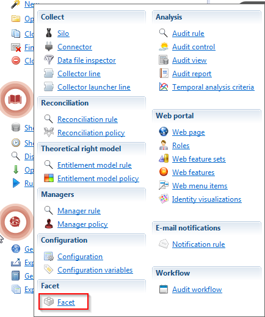
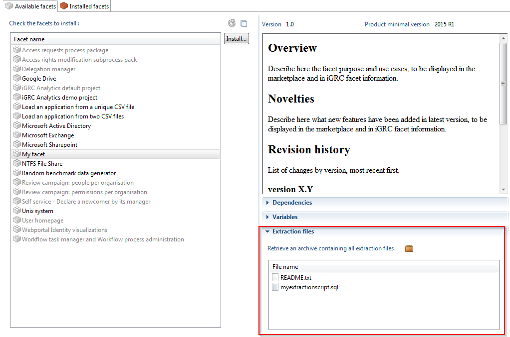
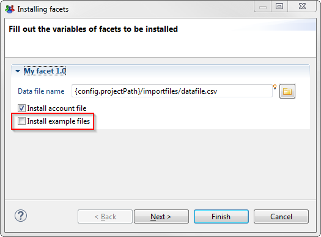

# Add-ons

## What is a facet?

A dedicated framework allowing to create your own add-ons, also known as facets, is included in iGRCanalytics. It can be used to help structure your project, so even if your goal is not to make a publishable facet, we advise you to check it out.  

A facet is basically a part of a project that can be installed and uninstalled at will, allowing to add / remove functionalities in a seamless way. Those can be collectors for specific applications, workflow processes, reports, examples or documentation, etc. The advantage of delivering project content in a facet over simply dropping a bunch of files are mainly:  

- the possibility to install and remove the files in a single operation, allowing to avoid interferences with the rest of the project
- the possibility to repeat the same installation on any number of iGRCanalytics instances  
- the possibility to track file modifications and to apply upgrades
- the possibility to provide out-of-the-box functionalities to people that will not need to understand every detail of the content, thanks to advanced features like variables usage or conditional installation of files
- the possibility to make your work available to others through Radiant Logic marketplace.

You can check out our [Tips for designing a facet collecting data](add-on-creation) if you are interested in creating a facet dedicated to a given application.

## Start a New Facet Project

To start with your facet creation, you can select **Facet** in the **New...** section of the main menu. You will have to give an identifier and a version for your facet.  

Validating this wizard will have the following effects on your project:  

- it will create a directory named after your facet in the `facets_info` folder
- it creates the main facet description file, called `manifest.xml`, in this folder
- it creates a `_resources` folder at the same location, containing all the additional resources needed to document the facet that will not be included in the project during facet installation  
- it adds directories named after the facet in the project main folders (`/collectors`, `/rules`, `/webportal/pages`, etc)

Don't panic when you see all those changes to your project, as you can very easily remove all those additional elements. In the **Build** tab of the facet editor, you will find options to remove / recreate the facet folders. Only the empty folders will be deleted, so you will need to remove the main folder in `/facets_info` manually. This option can also be used to tidy up your project from unnecessary folders when you are done adding files to build your facet.

To create a fully functional facet, you need to fill out the facet manifest, add the necessary resources for its tracking and publication, and drop the files you want in the relevant folders.  

## Facet Manifest and Resources

The facet manifest contains all the information needed for publication in the facet store, along with information displayed during the installation of the facet.  

Here are the main attributes that are required :  

- a unique identifier
- a version number (in the format x.y). This is especially important as the user will be prompted for updates when a higher version is available  
- a creation date. This field is required, but you can very easily change it to the current date using the dedicated button
- a product minimal version on which the facet can be used. It is automatically filled with your current version, and it is strongly advised not to change it unless you known what you are doing.
- the facet author. That would be you (or your company) !  
- a delivery status. This is mainly to indicate the development stage of the facet, and mark obsolete facets as deprecated
- a pricing, which you don't really need to bother with
- a type between Add-on or App. Most facets will be considered Add-ons, as an App has to thoroughly address a topic, from data collection to controls and restitution in reports and pages.  
- a list of tags (separated by commas) that will help reference your facet. Examples : Sharepoint, Microsoft, Server
- a category or list of categories (reports, connectors, etc)
- an icon file, which will be displayed in the facet store. It has to be placed somewhere in the `_resources` folder  
- English and French titles for the facet. Those will be displayed on the store as well as in the facet installation list
- English and French screenshots, used in the facet store. It has to be placed somewhere in the `_resources` folder

The option 'the facet is not installable or uninstallable' only concern facets that will be automatically included in projects, so should never be checked.  

In addition to this information, nationalized description files have to be provided. Those files, in HTML format, will be used both in the facet store and the installation description of the facet. They are automatically created in the `_resources` folder with a general canvas that will have to be kept ; clicking on a the button shown below will open the file in an HTML editor. Once modified, you can check the results by refreshing the view in the **Description** tab of the facet editor.  

## Facet Files and Folders

You only need to drop files in a directory named after your facet to have them automatically included in the facet. The files do not need to be directly under the facet folder either, as all files and folders will be embedded in the facet.  

Moreover, you are not limited to the folders that are created by the wizard, which are there to help you save time. If, for any reason, you need to have a file inserted into `/library/components`, you just need to create the folder `/library/components/myfacet` and put whatever you need inside.  

When building the facet, all the empty directories will be discarded, so you do not need to delete all your unused facet directories. Anyway, you can have them all deleted by using the dedicated action in the **Build** tab (see above for details).  

The **Build** tab offers an overview of all the files currently included in the facet. You can also open the file by clicking on it.  

> You can take advantage of the facet framework to manage your project, even if you don't intend to create a facet out of it. For instance, if you have a new application to integrate into your project, it might be a good idea to create a new facet for this application. You will then automatically have folders matching your application name, can track the files that relate to this application in the **Build** tab. And you still keep the option to create a facet out of it, be it to transfer it for testing purposes or to have it released on the facet store.  

## Extraction Files

Some data collection facets have to provide extraction means (scripts, libraries, documentation,...). Usually those files do not need to be installed in the project, but must be sent to the persons in charge of the data extraction on the physical systems.  

To this effect, a special treatment is reserved to a folder named **extractors** , which has to be created under the resources folder. The elements of this folder will not be deployed in the project, but instead can be retrieved in a zipped archive in the project facet tab.  

## Example Files

Is is possible to include optional example files in your facet. This can help provide an example of a data file, a report, a control, etc. Simply add those files in a directory called 'example' in any of the facet directories, and they will automatically be included in the facet, and the user will automatically be provided with a choice to include those example files when installing the facet.  

## Dependencies

Dependencies are facets that need to be installed for your facet to be functional. For example, you would need to have the Active Directory facet installed for Microsoft applications using the Active Directory accounts and groups to be correctly loaded, or you would require the task manager in order to be able to launch the new process contained in your facet.  

You can declare dependencies in the 'Dependencies' section of the editor main tab. The facets have to be selected in the project, but can be other facets still under construction as well as facets already packaged in a .facet file.  

Declaring dependencies will make sure they will always be installed along with your facet, and will prevent facet installation if they are not available.  
