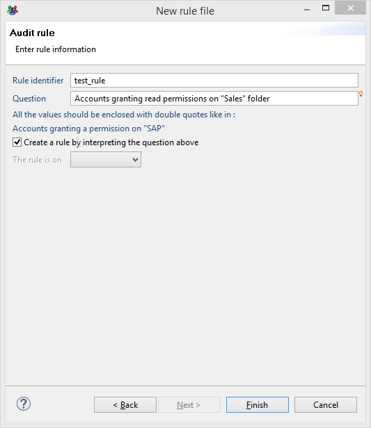
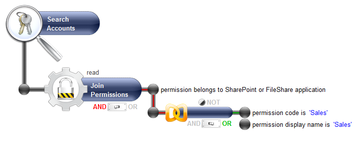

# Advice and Best Practices

## Tree Diagrams and Rule Naming

The rules are located in the `/rules` directory of your audit project. The rules carry the extension `.rule`

## Alias

Using an alias severely limits the capacities of the rule engine. Be careful not to use aliases unless absolutely necessary and to respect the following principles:

- Do not use sub-rules in your rule
- Limit the use of combination components
- So far as is possible, reference the attributes of the root concept as second attribute values (`root.xx x`)
- Do not reference other attributes to the concepts except those that are on the parent branch of your criterion.

## Reports

It is preferable to use rules dynamically in the reports by associating the rules in the reports rather than using the 'saved rule results'. This avoids having to store the rule results in the base.

## Create a Rule Using Natural Language Questions

During the rule creation wizard, you have the possibility to initialize the new rule by asking a natural language question.  

In the rule creation wizard, there is an input box where you can ask a question in a natural way:  

  

The created rule will be initialized with the asked question, for instance in the previous example it will be:  

  

Note that this functionality only applies to the initial creation of the rule. After that it can still be modified in any way applicable to a rule.  

## Example

Here are some examples of questions you may ask:  

- Accounts offering write privileges on the "Sales" folder
- Accounts created before March 2014 and belonging to no group
- People managing the "SAP" application
- Who are the active identities owning a disabled account  

## Known Limitations

Note that the values such as group names, organization names and so on, must be enclosed by double quotes ("). For instance, in Accounts granting a permission on "SAP" the double quotes around SAP are mandatory.  
