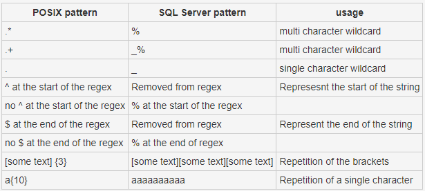
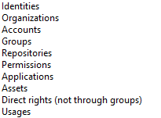
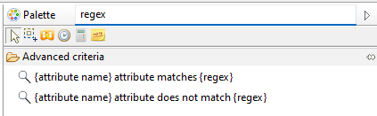

# Regular expressions specificities depending on database

## Postgres and Oracle

If you're using postgres or oracle, all POSIX rules are applied natively.
This allows you to use all existing regex pattern types available in their implementation.

[Postgres documentation](https://www.postgresql.org/docs/current/functions-matching.html#FUNCTIONS-POSIX-REGEXP)

[Oracle documentation](https://docs.oracle.com/cd/B13789_01/appdev.101/b10795/adfns_re.htm)

## SQLServer

Regular expressions are not natively supported. We implemented theme by using  the SQLServer **"LIKE"** operation in combination with some transformation beforehand.

Here's the list of transformations we've implemented.

You can directly use the POSIX characters above in your regular expression, as the software handles transofmation.
Note that the operation of **"[]"** brackets in sql server is identical to that of classic regexes. They can therefore be used in the same way, even if they are not present in the table above.

# How to use regular expressions

## Rule editor

Regular expressions are available in all main rule categories except metadata.

The criteria is located in advanced criteria and is named **"{attribute name} match regex {regex}"**

## View editor

In the view editor, you can use regular expressions as a filter on any attribute of type String.

