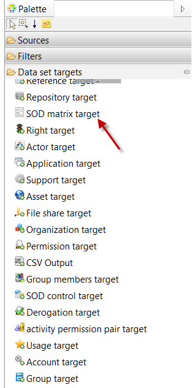
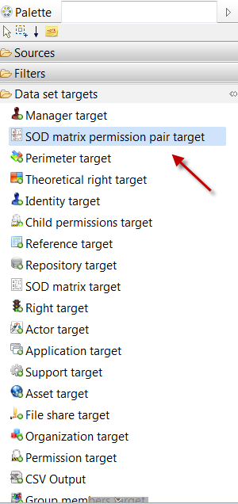
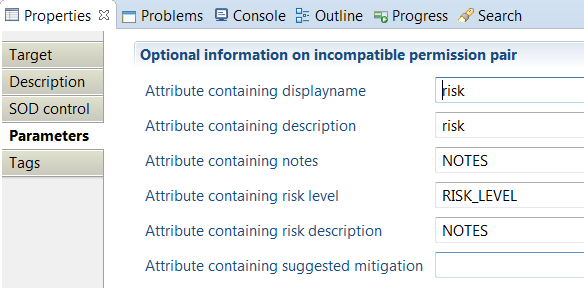
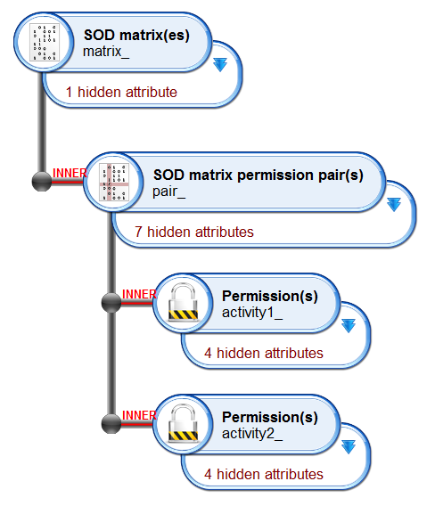

# Data collector components

## Filters

Please refer to the following [sub-page](/filters) for the documentation of all data collection filters available in the product.

## Sources

Please refer to the following [sub-page](/sources) for the documentation of all data collection sources available in the product.

## Targets

Please refer to the following [sub-page](/target) for the documentation of all data collection targets available in the product.

## Collecting Sod Matrix

This document describes how SoD Matrix are collected in Identity Analytics. Usually, SoD matrix are maintained in organization in different Excel sheets in specific format where each SoD rules is relative to an incompatibility of a rights/permission vs another one.

The traditional format for such matrix in external Excel sheets usually use pivot table:

  

Identity Analytics data model concept integrates the two following SoD concepts:  

- SoD Matrix (with a identifier, a name, a description)  
- SoD permission pair (attached to an existing SoD Matrix, and referencing a pair of two incompatible permissions).

The SoD Matrix and permission pair generates standard control discrepancies.

### Procedure

In order to define SoD Matrix, an additional target is available in collector palette:

  

The SOD matrix target creates a new matrix in Identity Analytics data model:

  

  

In order to define SoD rules, an additional target is available in collector palette:

  

This target add new SoD rules in an existing SoD matrix:

  

A rule has to be inserted in an existing SoD Matrix. This rule references first permission incompatible with a second one:

  

Additional information can be added for each risk:

  

Some SoD components can be used in views to list information regarding collected SoD Matrix and SoD rules (permission pairs):

  

### Example

The attached SODsample.facet includes an example of SoD rules collect, and SoD matrix report.

- `importfiles/SOD/SOD_example.xlsx`: excel sheet including some sample SoD rules
- `discovery/SOD/SOD.discovery`: excel sheet discovery
- `collectors/SOD/SOD.collector`: SoD Matrix and rules collect
- `collectors/SOD/SOD.javascript`
- `views/custom/SOD/SOD_matrix.view`: view to retrieve SoD matrix information
- `reports/custom/SOD/SOD_matrix.rptdesign`: sample SoD matrix report

### Downloads

[SODsample.facet](https://download.brainwavegrc.com/index.php/s/zZkRnaQe4DNQ8ER)

## Depreciated Components

### Depreciated sources

Historically when developing a data collector line the only sources available were the following.

- Formatted source
- LDIF source
- Excel Source
- XML source
- CSV source

These sources only allowed the user to collect the raw data from the source file. All post processing actions had to be done in the collector line.  
In order to bypass this limitation a new source was created to replace all above mentioned sources: the filtered source (discovery).  

As a result, these sources remain in the product for compatibility reasons, however it is **highly** recommended to use a Filtered source.  

Please see the Filtered source description for more details.

#### File enumerator

The files enumerator source is delivered with the files enumerator facet.  
This facet allows the user to iterate on a number of input files in a collector line, different LDIF files corresponding to different domains, for example.  
This facet was developed before the addition of silos in the version 2015 that included this functionality by default in the product.  
As a result, this source remains in the product for compatibility reasons, however if you wish to iterate over input files it is highly recommended to use the iteration capabilities of silos:  

#### SOD control target

This target is deprecated. It is recommended to use both SOD matrix target and SOD matrix permission pair target to create SOD controls.  
This deprecated target was used to generate a project file (a .control) for each matrix cell. The new SOD matrix targets share the same goal but the matrix cells are stored in the Ledger.  
