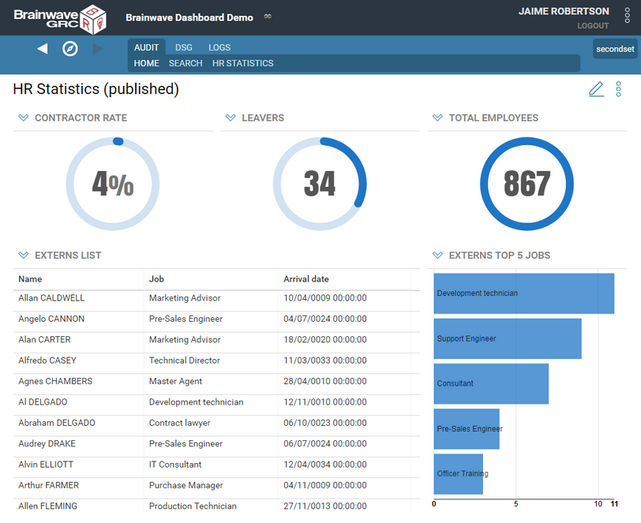
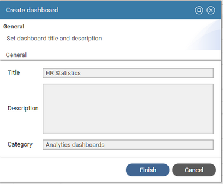
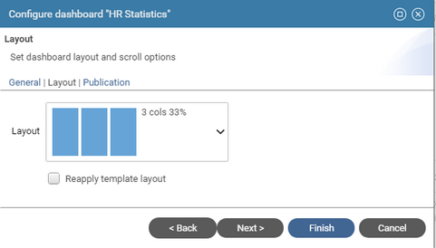

# Dashboards

## Introduction

### Audience

This documentation is intended for the following personas:

- _Dashboard Designers_ that are functional users in charge of designing dashboards and sharing them with other users, directly from a web browser. They must have the **designer** role.
- _Technical consultants_ that have access to the iGRC platform to perform technical tasks such as installing components, creating or modifying views and rules, managing roles...
- _Platform Administrators_: administrators of the iGRC platform or users with the **igrc_administrator** role.

### Identity Analytics Context

As of 2017, a new functionality has been implemented that allows functional users to design their own dashboards directly from the web portal and share them with selected users.

Dashboards include tables, charts (bar, horizontal bar, pies and doughnuts) and gauges. They will display in various formats any data coming from Audit Views (including  Business Views, and Audit Logs Views). Furthermore the displayed data can be optionally filtered to target a given population (_e.g._ people in Finance department, accounts with system privileges, etc.) , leveraging all the richness of iGRC Identity Ledger.

Following is a example of a Dashboard:

Creating dashboards requires 4 steps:

1. Preparing your environment for dashboard design. This action is performed only once.
2. Creating dashboards using the web portal.
3. Creating specific data access components for your dashboards using the Studio.
4. Publishing the dashboards to other users.

These steps will be detailed in the next pages.

## Installation

To enable the use and creation of dashboards in the webportal it is required to install some components in the studio and to perform a series of configuration operations before deploying the webportal.

1. Install the radiantlogic Identity Analytics core product version - Descartes (see installation instructions).
2. Launch IGRC Studio and open or create an Audit project
3. Install the required "Mashup Dashboards Support" facet:
    1. Click on the link [Mashup dashboards support](https://marketplace.radiantlogic.com/) to download the Add-on from the **RadiantOne MarketPlace**  
This add-on includes a large set of predefined views and rules for commonly used data and two predefined resource templates (default and flatcolors) to be used in your dashboard.
    2. Install the facet file in your project
4. Declare the dashboard resource templates to be used in your dashboards. Resource templates include chart styles and dashboard layout templates.
    1. Open the **technical configuration**  of your project, **web portal**  tab, **dashboard resource templates** and make sure at least **default** dashboard resources template is selected.  
You can select more than one resource templates using the button to the right.

5. Grant the **designer** role to the Dashboard Designers to allow them to **design** and share dashboards. This is done in the `.role` files located in the `webportal\features` folder  
6. Export the web portal and deploy it to your web application server.

> Users do not need any specific role to access dashboards that have been shared with them

## Create a Dashboard

The following steps show how a designer can create a dashboard in the web portal:

- Log in to the web portal as a dashboard designer ( with '**designer**' role)  
- Select **Manage dashboards**  from the menu to the top right corner of the page

- The **Manage dashboards**  page displays the complete list of dashboards created by the current user. Please see the **Managing dashboards** section for more information.

> Users that do not have the dashboard design role will not see this menu item.

- Click **Create** button to create a new dashboard
- Give the newly created dashboard a title using the **Title** box. It is recommended to use short titles to save screen space
- Fill in the dashboard description if necessary. This field is used to explain the purpose of the dashboard.
- To display the dashboard in a different top-level menu use the **Category** box.
  - If the category is left empty, the dashboard will be displayed in the first top-level menu: **Audit**  
  - Menus are sorted alphabetically.  

- Click **Finish** to create the dashboard with no content.
- The new dashboard appears in the **Dashboard list,**  as well as in the portal menu bar, at the specified position.

- Select the dashboard from the list and click **View** to open the dashboard page.

Alternatively, you can also select it from the menu bar.

## Add Content

To modify a dashboard's contents:

- Display the dashboard (either by selecting it in the menu, or from the dashboard manager list)
- Click on the pencil icon to the right of the dashboard title,

- Alternatively, select the **Edit...** menu item from the dashboard menu
- The dashboard design toolbar is displayed:  

The table below describes the purpose of the toolbar's buttons:

|||
|-|-|
| | Inserts a table component at the end of the dashboard |
| | Inserts a gauge component at the end of the dashboard |
|| Inserts a vertical bar chart component at the end of the dashboard |
|| Inserts a horizontal bar chart component at the end of the dashboard |
|| Inserts a doughnut chart component at the end of the dashboard |
|| Inserts a pie chart component at the end of the dashboard |
|| Allows to configure the dashboard properties (title, layout scheme, publication options) |
| **Save** | Saves the dashboard changes to the database. If the dashboard is published, this will make the changes available to the dashboard audience |
|  **Discard** | Discards all the changes since the last save. |

To add components to your dashboard, click on one of the first icons in the toolbar.
This will display the components configuration wizard.

Before adding content to your dashboard, It's recommended to think of the overall design of the dashboard (number and type of components) then to define its layout scheme.

## Layout configuration

Dashboard components are arranged according to a **grid layout** , where the display space is divided in a fixed number of columns and a varying number of rows.  
Grid layouts are commonly used in web design to ensure clarity and readability of the displayed content whatever the size of the display and because it's easy to put in place (no pixel headaches).  
Each component of the dashboard can span one or more columns and one or more rows of the grid, but it cannot cover a fractional part of a grid cell.

To define the layout of your dashboard, do the following:

- Click the configuration icon or select the **Configure** menu item from the dashboard menu to open the dashboard configuration wizard
- Select the Layout tab  

- Select one **Layout** scheme from the list of predefined layouts.
You can select either a simple columnar scheme (_e.g._ 1 column, 2 columns, 3 columns, 4 columns) or a more complex scheme (_e.g._ 3 columns + full ).
- Check **Re-apply template layout**  to force arranging the dashboard content according to the selected layout , in case the components have been moved or resized manually.
Dashboard content is automatically arranged if another layout scheme is selected.
- Click **Finish** to set the layout scheme to use when components are added.

Each new component will be added to the end of the dashboard, following the currently selected layout scheme.
You can modify the position and size of a component while in edition mode using either ways:

- **Resize** through component **Edit** > **Basic** tab > **Size** fields (except for gauges which are always 1x1)
  - type a number for **Columns**  (up to the number of columns in the dashboard layout scheme)
  - type a number of **Rows** (unlimited)
- **Move**  a component by holding down the mouse over the component title bar (the cursor will change to a cross hair) and dragging around until its correct place.
- **Resize** a component by holding down the mouse over the resize corner (the cursor will change to an oblique double arrow) and dragging around to resize the component.
- A light grid outline is displayed to materialized the current grid layout setting. You can turn it off by unchecking **Display Grid**  option in the dashboard menu.

Once the layout is set, you can add widgets to your dashboard, they will automatically be placed and sized according to the selected layout.
