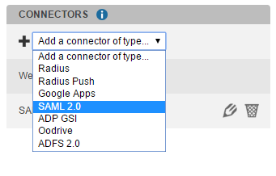
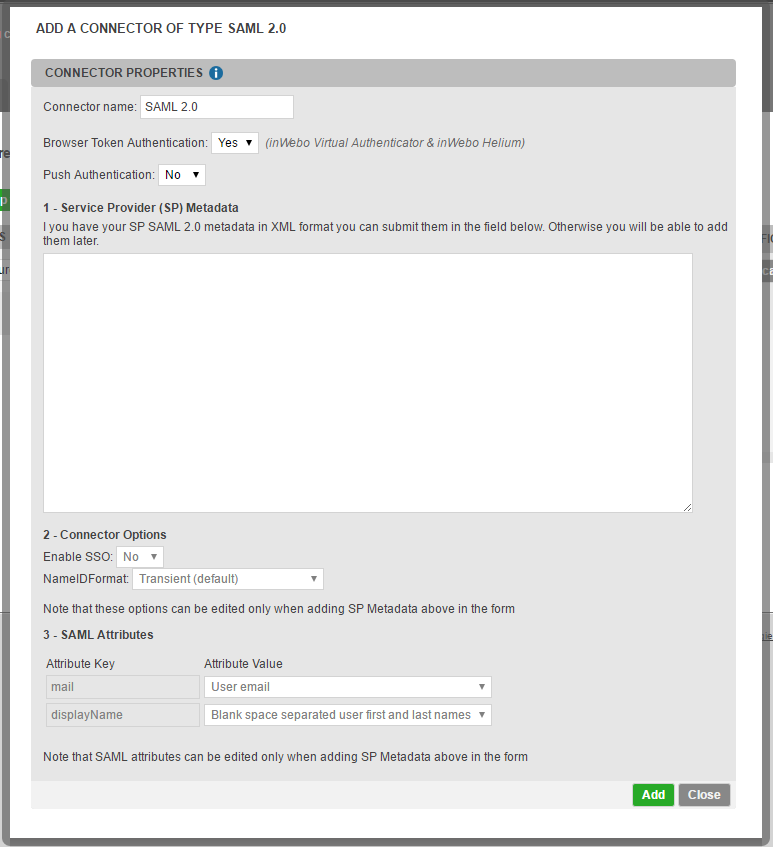
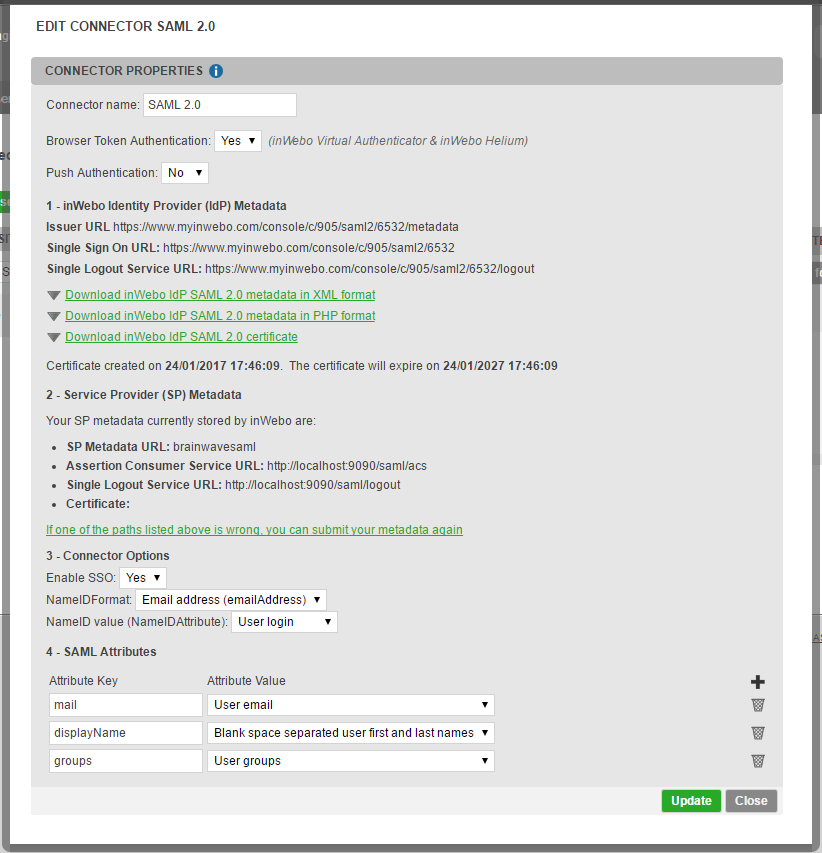
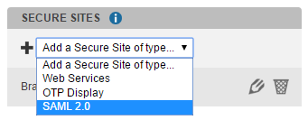

# InWebo application declaration

> [!warning] The information listed here is provided as an example only. This methodology is not supported by Identity Analytics, but has been tested.

Connect to the **inwebo** administration console https://www.myinwebo.com/console/admin and create a new `SAML 2.0` connector.  

Configure your `SAML 2.0` connector. The easiest way is to prepare a `sp-metadata.xml` file (see below for more details on this) and to copy/paste its content in the `Service Provider (SP) Metadata` section.  

Once this is done, download the **inWebo** `SAML 2.0` metadata file in `XML` format by clicking on the hyperlink, you will have to declare this file in the `Identity Analytics SAML connector` at a later stage.  

Update the `NameID format` and change it from `Transient` to `Email address (emailAddress)`.  

If you want to propagate roles to the web application, configured as groups in **inWebo**, add a `SAML` attribute:  
`groups` as a **name** and `User groups` as a **value**.  

Declare a new application, select `SAML 2.0` type.  

Configure your application name and the main `portal URL`.  
Select either `give access to all users` or `give access to only defined groups of users` depending on your security settings (start by give access to all users for test purposes).  

Once the configuration is done, and depending on the `give access` settings, your **inWebo** users will now be able to access the **Identity Analytics portal**.  
