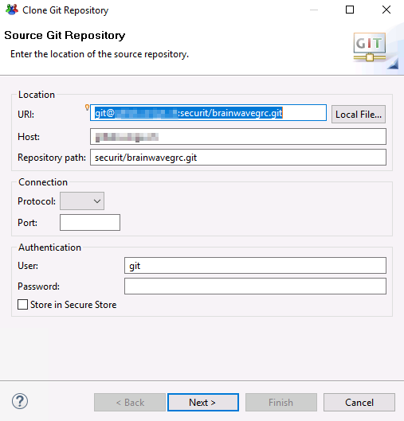
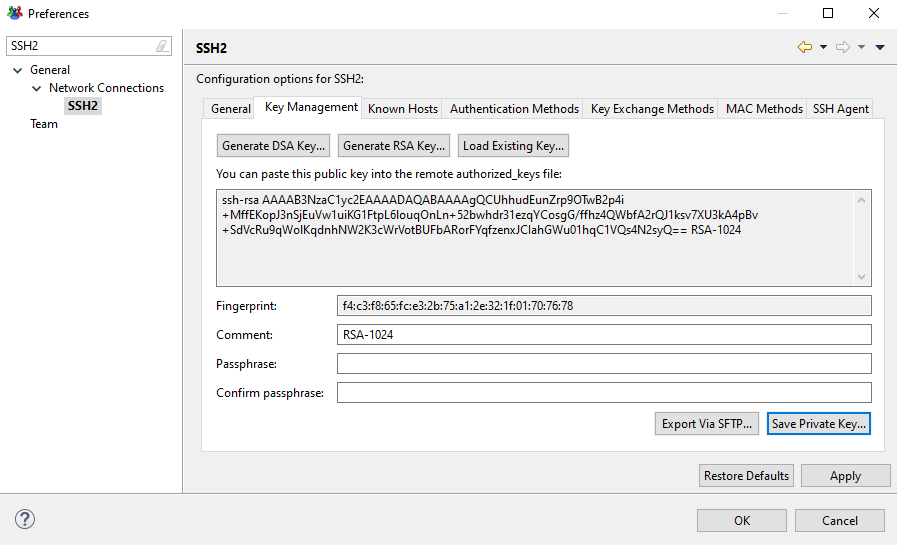
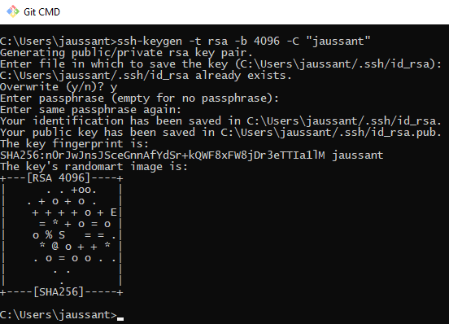
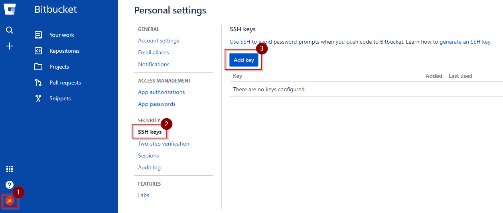
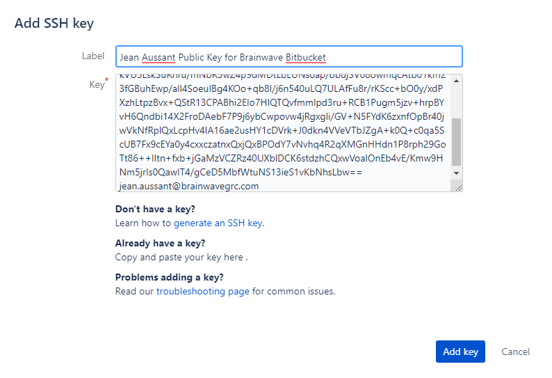
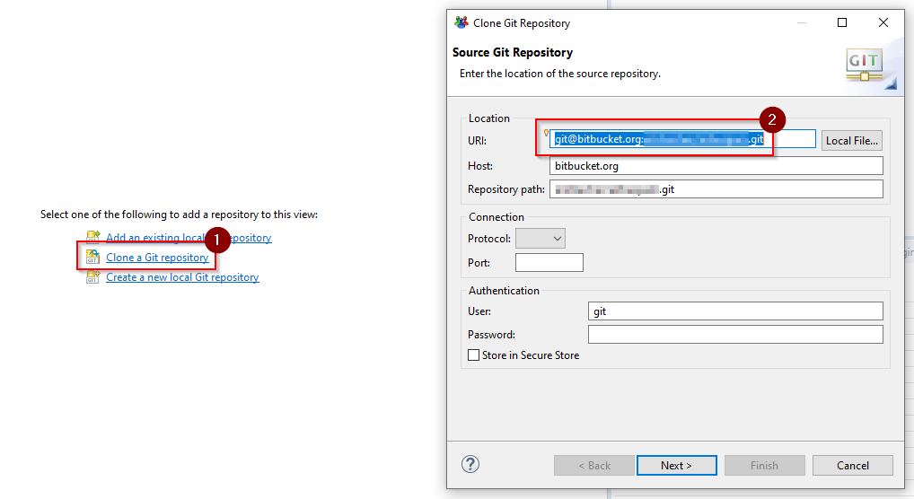
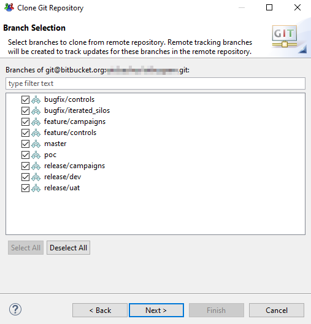

# Git repository connection using SSH

Usually, we connect to a repository from Git using HTTP (something like below).


But, did you know that is also possible to connect using SSH ?



If not, here is the procedure to follow to plug your iGRC project to Git using SSH:

## SSH configuration on Studio

First, you have to configure the SSH settings of your Studio:

- Go to the `Preferences` menu
- In it, go to `SSH2` section  
- On `General` tab, configure the home folder for SSH

> The folder should be named **.ssh** and located under your home directory (see below example). If not created yet, please do so.


## Create a couple private/public keys

Then, you need to generate a couple of private/public keys. Both methods are available:

- Using the Studio  
  - Go to the `Preferences` menu
  - In it, go to `SSH2` section and go to `Key Management` tab  
  - Then, click on `Generate RSA key...` (it works the same for `Generate DSA key...`)
  - Save both private/public keys clicking on `Save Private Key...` (you can add a passphrase if you want)



- Using a command line (you need the **ssh-keygen** utility available)  
  - Open your terminal
  - Using ssh-keygen command, you can generate your couple of keys (see an example of line and the result below)



**Note:**

> Take care about the -C option to set your exact Git account login.

- Your private and public keys should be now available (a file without extension for the private key and a **.pub** file for the public key)!


Once your keys are created, you should now declare the public key in your Git account profile. Depending of the Git used, the principle is to copy/paste the public key. See below example with BitBucket :






## Create and configure a SSH configuration file

The next step is to create a SSH configuration file:

- In the SSH home folder containing your keys, create a **config** file
- Put and adapt the below content with your contextual information

```properties
Host <FQDN_OF_GIT_SERVER>  
HostName <FQDN_OF_GIT_SERVER>  
IdentityFile ~/.ssh/id_rsa  
User <GIT_ACCOUNT_LOGIN> 
```

Here is an example for Identity Analytics Bitbucket:


## Plug to the Git repository

You have now all that you need to connect to the Git repository from your Studio. Copy/paste the URI from the remote Git server of the repository you want to clone.  

Let all values by default, it should work as is.



- Click on `Next`
- For the first time, you should be asked for
  - Host declaration in the SSH known hosts list
  -**known_hosts** file creation to put the host to reach


- You should now be asked for the selection of branches in the repository



From this step, you should be able to see the project in your Studio and work on it!
