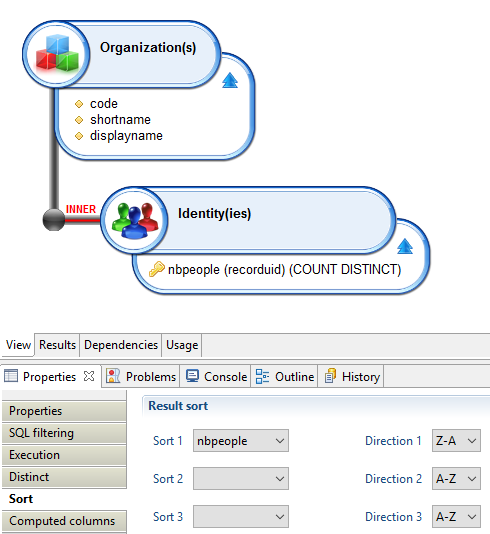
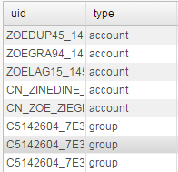
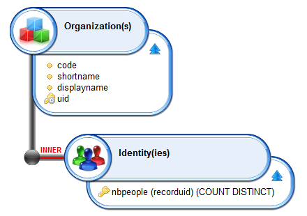
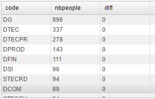

# Advanced Data Binding

## Disable a Record or a Dataset

In some cases, there are some records or datasets that are not needed under certain conditions.  
For example, if the only widget that displays a dataset is hidden then this dataset is not needed.

In these cases, we can disable the record or dataset using the same [condition or predicate](./16-predicate-functions.md) that is used to hide the widget. To do this we can use the attribute:  

**disabled** takes a boolean value (or result of one of the Predicates)  
&emsp; if true, the record or the dataset will be disabled.  

This can be useful in some cases when we need to improve performance. Otherwise, all records and datasets that are actually used by a widget of the page will be executed (even if the widget is hidden).

## Retrieve only the first rows of a Dataset

You can specify that you are only interested on the first rows of a Dataset by using the **limit** property.  

This is interesting when used with sorted views as you will be able to present for instance the top 10 people with the most problems, the top 10 organisations with the most people, ...  

Here is an  example:  

You define this view:  

  

And you declare your dataset as:  

```page
orgwiththemostpeople = Dataset {
    view: organisationwithpeople
    limit: 10
}
```

## Filtering results of a Dataset

We can filter the results of a dataset using either one of these attributes:  

`includes: Boolean Expression`  
&emsp; It will keep the result only if evaluation of the [Boolean Expression](./16-predicate-functions.md)  

`excludes: ``Boolean Expression`  
&emsp; It will filter out the result only if evaluation of the [Boolean Expression](./16-predicate-functions.md)  

The boolean expression can be any of the available [Predicates](./16-predicate-functions.md)), It will be evaluated for each row of the dataset.  

We can access the values of the current item by using the keyword **Current**.  

For example if we have a multi valued variable called **usedUids** , we can:  

```page
accounts = Dataset {
    view: br_account
    excludes: MultivaluedPredicate (  usedUids contains Current uid )
}
```

We will exclude all the accounts with an uid in the list usedUids  

Or  

```page
accounts = Dataset {
    view: br_account
    includes: MultivaluedPredicate (  usedUids contains Current uid )
}
```

We will include only those accounts with an uid in the list

## Storing the number of elements of a dataset

We can use the `count-variable:` attribute of a dataset declaration to store the number of elements of this dataset in a variable. For example:

```page
accounts = Dataset {
    view: br_account with selectedRepository to repositorycode
    count-variable: numberOfAccounts
}
```

where the variable `numberOfAccounts` is declared as:

```page
numberOfAccounts = Variable {
    type: Integer
}
```

> - When the dependencies of a dataset change, the value of the variable will be updated with the new count (for example the `selectedRepository` variable in the previous example),
> - If you manually change the value of the variable (with a `Set` in an action for example), its value will differ from the count of the dataset until one of the dependency of the dataset changes (which will trigger an update of the count).

## Dataset with Static Values

It is possible to define a dataset with static values using the attribute values :  

```page
staticDataset = Dataset {
    values: [( columnId -> "row1col1", secondColumn-> "row1col2"),
             ( columnId -> "row2col1", secondColumn-> "row2col2")
            ]
}
```

It is also possible to use variables instead of constants values.

## Dataset from Multivalued Variables

If we have one or more multivalued variables and we need to have them in a dataset so that it can be used by an iteration widget, we can create one like this:  

```page
dataSetFromVariables = Dataset {
    columns: multivaluedVariable1 as col1 , multivaluedVariable2 as col2
}
```

## Datasets Unions

It is possible to create a new dataset with the union of two previously created datasets:  

```page
unionDataset = Dataset {
    union: Union {
        datasets: dataset1 , dataset2
        discriminator-column: source
    }
}
```

The resulting dataset will be the union of both. So it will include all the rows of dataset1 and all the rows of dataset2.  

In order to identify the original dataset, we introduce the concept of discriminator.  

The purpose of the discriminator , is to identify the source of each item in the resulting dataset.  

Each original dataset has a discriminator, if we dont specify a value, the discriminator will be the identifier of the dataset. We can customize this like this :  

```page
unionDataset = Dataset {
    union: Union {
        datasets: dataset1 discriminator "source1", dataset2 discriminator "source2"
        discriminator-column: source
    }
}
```

The discriminator-column is a new column that will be added to the resulting dataset containing the value of the discriminator for item.  

This can be useful if for example we make a union of two datasets from different concepts:  

```page
unionDataset = Dataset {
    union: Union {
        datasets: accountsDataset discriminator "account", groupsDataset discriminator "group"
        discriminator-column: type
    }
}
```

Here we will have accounts and groups mixed in one dataset. So we will probably need to be able to identify if an item is a account or is a group.  

In order to do that, we declare a discriminator for each dataset, and the discriminator column is called type.  

We will get something like this as a result:  

  

Attributes:  

**discriminator-column**  (required) is the name of a new column that will be added to all the rows with the value of the discriminator.  

## Joining Datasets

Similar to the Union, we can also make a join of two datasets.  
For a join, the first thing we need to do is to identify which will be the primary dataset and secondary dataset.  
After, we identify the key column in each dataset, the key is the column that will be used to match the items in both datasets.  
The join will try to match the items from both datasets.  

For the primary dataset we will have these options:  

**primary-dataset** will be the identifier of the primary dataset  
**primary-column** is the column(s) in the primary dataset that contains the key  
**primary-prefix** will be the prefix that will be added to all the columns of the primary dataset  
**primary-optional**  
&emsp;**False** (default) the key must exist in the primary key, resulting dataset will not accept results that dont exist in the primary dataset  
&emsp;**True**, the final dataset can contain records of the secondary dataset that are not present in the primary dataset  

For the secondary dataset we will have these options:  

**secondary-dataset** will be the identifier of the secondary dataset  
**secondary-column** is the column(s) in the secondary dataset that contains the key  
**secondary-prefix** will be the prefix that will be added to all the columns of the secondary dataset
**secondary-cardinality**  
&emsp; if **mandatory many** (default) will only keep items of the secondary dataset that matches the primary dataset ( can be many of them )  
&emsp; if **optional many** will keep records of the secondary dataset even if they don't have a match in the primary dataset  

There must be the same number of columns in primary-column and secondary-column.  

As a general rule, If you dont provide a value for **primary-optional** and **secondary-cardinality** the default values will be taken.  
This default combination could be considered as a equivalent of an **inner join**.  
**primary-optional False and secondary-cardinality mandatory many**  

A second common combination of values, equivalent of a **left join** :  
**primary-optional False and secondary-cardinality optional many**  

A default example (with a result similar to an inner join):  

```page
joinDataset = Dataset {
    join: Join {
        primary-dataset: dataset1
        primary-prefix: d1id_
    primary-column: uid

     secondary-dataset: dataset2
     secondary-column: uid
     secondary-prefix: d2id_
    }
}
```

  

A default example with results similar to a left join:  

```page
joinDataset = Dataset {
 join: Join {
 primary-dataset: dataset1
 primary-prefix: d1id_
 primary-column: uid
 primary-optional: False

 secondary-dataset: dataset2
 secondary-column: uid
 secondary-prefix: d2id_
 secondary-cardinality: optional many
 }
}
```

  

"# Computing trends

You can compute trends automatically on dataset. This is a powerful feature which can be used with any kind of information within the Identity Analytics data model as long as you calculate a metric.  

Here is an example:  

You declare this view:  

  

You want to identify if some organisation changed in terms of size, here is the corresponding dataset:  

```page
orgpeople = Dataset {
    view:orgpeople
    trend:Trend {
        timeslot:FromPage(-1)
        join-column:uid
        difference-column-name:diff
        value-column:nbpeople
        exclude-new:False
        exclude-same:False
        include-removed:False
    }
}
```

It automatically adds a column to the dataset named after the 'difference-column-name' property (diff) in our case:  

  

```page
Table {
    data:orgpeople
    layout:Layout{grab:horizontal True vertical True}

    Column{column:code}
    Column{column:nbpeople}
    Column{column:diff}
}
```

Here is how it works:  

**join-column**: the column that will be used to find the same entry in the other timeslot, most of the time you declare an uid here but you can also for some complex use case declare a computed column built based on uids (account + permission for instance)  
**timeslot**: the timeslot that will be used to compute the trend. You can specify either an absolute value (a timeslot uid) or a relative timeslot. In this example we use FromPage(-1) to declare that we are interested by the previous timeslot to compute the trend. Note that since version 2017 R3 SP1, reference timeslots will be used when available (see the section on timeslot selection in [Data Binding](./04-data-binding.md)).  
**value-column**: the column you will be used to compute the difference. It must be an integer.  
**difference-column-name**: the name of the column that will be dynamically added in the dataset.  

You can filter the results with the following keywords:  

**exclude-new**: exclude new entries  
**exclude-same**: exclude entries when the diff value equals to 0  
**include-removed**: include removed entries. warning : you won't be able to build hyperlinks from those entries are they are no longer present in the Identity Ledger.  

## Identifying new and removed entries in a Dataset

You can leverage the Dataset Trend feature for this.  
You create a view with a computed column on type integer and with 1 as a value.  

  

```page
identities = Dataset {
    view:identity
    trend:Trend {
        join-column:uid
        status-column-name:status
        value-column:val
        timeslot:FromPage(-1)
    }
}
```

The status column will contain:  

**Identical**: The entry was present in the previous timeslot and is still present  
**New**: The entry is a new one  
**Removed**: The entry in no longer present  

Note that if the 'val' column contains a real value, the status column can also contain:  

**Modified**: The 'val' attribute contains a different value in the two timeslots  

## Datasets of Pages

Datasets can also be used to contain a list of pages or reports. This list of pages can be iterated to dynamically create links for example.  

In order to do this, we use the tag attribute for each page.  

```page
pagesReportsDataset = Dataset {
    pages: Pages { tags: "identity" and "browsing"}
}
```

This example creates a dataset with pages and reports that contain both tags: identity and browsing.  

```page
reportsOnlyDataset = Dataset {
    pages: Pages { tags: "identity" and "browsing"  hide-pages: True  }
}
```

This example contains only reports  

```page
pagesOnlyDataset = Dataset {
    pages: Pages { tags: "identity" and "browsing"  hide-reports: True  }
}
```

This example contains only pages  

After, we can dynamically create links this way:  

```page
Link {
    iterate-on: pagesReportsDataset
    target: Dynamic( Current type, Current name )
    value: Current description
}
```

## Batched Reports Dataset

Allow to query the current queue of batched reports for the connected user, for example.  

```page
batchedReports = Dataset {
    batched-reports: BatchedReports {
        status: Submitted, Running
        submission-date: after Date.offset(-5 days)
    }
  }
```

The possible attributes of the BatchedReports block are:  

- with-anonymous: (a boolean predicate): also contains anonymous reports along with reported scheduled by the current user,
- status: (a list of execution status): batching statues are Completed, Submitted, Running and Error. A status can be preceded by the Not keyword in order to invert the selection,
- submission-date: (a date interval): only contains reports submitted after or before a date or between two dates,
- completion-date: (a date interval): only contains reports completed after or before a date or between two dates.

## Hierarchical Dataset with lazy loading

In the standard use of Hierarchical Dataset we have 1 view that contains all the information about all items and also the information about how to connect items in the tree.  
We will be able to expand a Tree very fast because the information is all already loaded. However, this can reduce performance at load time since the page needs to load all the data first.  

There is an option to implement the Hierarchical Dataset with two views:  

- One view for the root elements only
- One view  to get the children of 1 element

The Tree will execute the first view at load time. It will be fast because it only load the root elements. Then , when the user demands to expand an item, it will execute the second view.  

For example:  

The root view will be called `br_organisation_root` :  

  

This view will return all organisations without a parent. So, root organisations.  

And a second view `br_organisation_children` :  

  

This view receives one parameter `parent_uid`, and return the list of children of organisation. Empty if none.  

Then we can declare our Hierarchical Dataset like this :  

```page
organisationTree = HierarchicalData {
 roots-view: br_organisation_root
 attribute: uid
 children-view: br_organisation_children
 parameter: parent_uid
}
```

Attributes:  

**roots-timeslot** used for timeslot selection  
**children-timeslot** used for timeslot selection

## Connected user Portal roles

It is possible, from a Page, to display all portal roles (static and dynamic) of the current connected user (and only this one) using the below dataset:

```page
myRoles = Dataset {
  roles: Roles
}
```
