# Feature and Roles

## General concepts

Identity Analytics Access rights model is based on roles and features.  

The principle is that if a Page or a widget is not associated with any feature, then every user can see it and use it.  
On the other hand, if a widget is linked to a feature, then only the users that have this feature will be able to see it and use it.  

So, widgets that need to be secured are linked to **features** and a user **has** features.  

For the first part he association is direct. Widgets that support features can be associated with existing features using the syntax:  

`feature: featureIdentifier`  

However, for users is different, the relationship between users and features is more complex.  

One or many **Features** are grouped into **FeatureSets**. **FeatureSets** are associated with **Roles**. And finally **Roles** are associated with **Users**.  

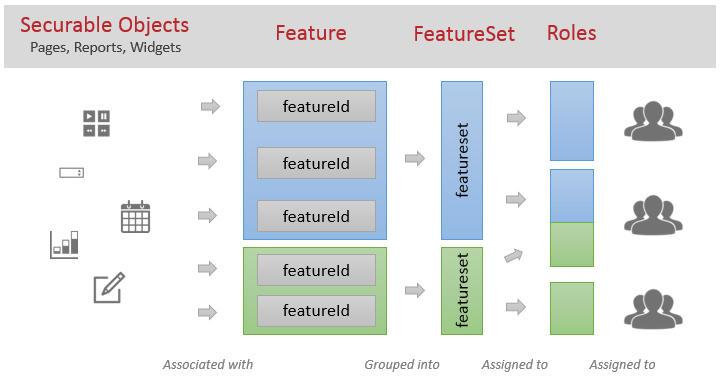  

This organisation of access rights models is inspired in the need to group fine-grained access rights into groups that can after be used many times.  

It offers many possibilities, for example we can think about a classification like the following:  

**Feature**  
&emsp;used to identify fine-grained technical rights.  
&emsp;example: readAccountFullname , readAccountCode  

**FeatureSet**  
&emsp;used to identify functional-based rights, grouping many technical rights  
&emsp;example: seeAccountDetails ( will contain features readAccountFullname, readAccountCode  
&emsp;and others )

**Roles**  
&emsp;usually more in sync with organisational roles. It will group many functional-based rights  
&emsp;example: accountAdministrator ( will have the rights of the featureset seeAccountDetails and others )  

Lets take a closer look into each one of these concepts  

## Features

Features are described in files with extension ".features" placed in folder webportal/features.  

  

A features creation wizard will walk you through the process. First a filename:  

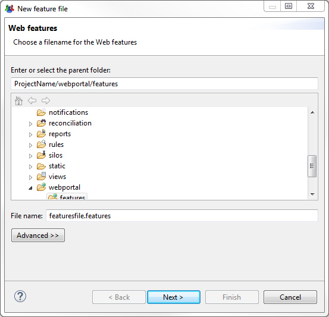  

Then some unique identifier and description for this file.  
Here, it will offer the option to change the standard feature to FeatureSet assign method:  
Default one, is the first one (Recommended).  

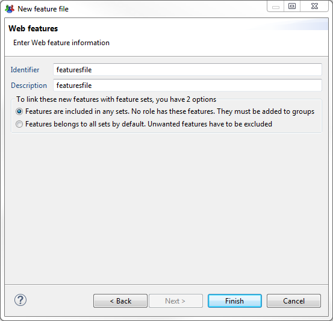  

Then it will be posible to add new features to this file by clicking on "Add..."  

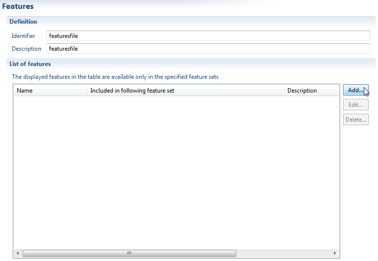  

To create a feature you need to provide:  

- Name or identifier
- Description (Optional)
- Select the featuresets that will include this feature ( Can be done later )  

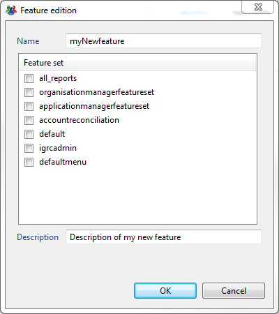  

Many features can be declared in the same file. And they will be usable from any page of the project.  

## FeatureSet

FeatureSets are declared in a file ".featureset" placed in folder webportal/features.  

  

A featureset creation wizard will walk you through the process. First a filename:  

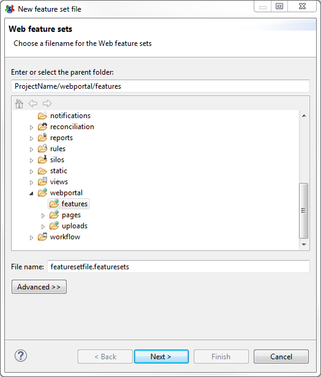  

Then we will need an identifier and a description for the file.  

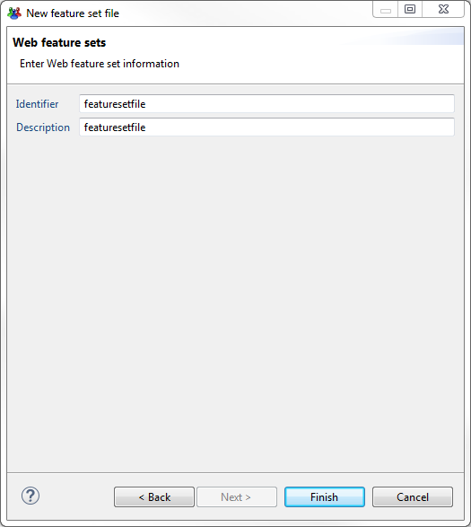  

Once the file is created you can create a new featureset by clicking on "Add.."  

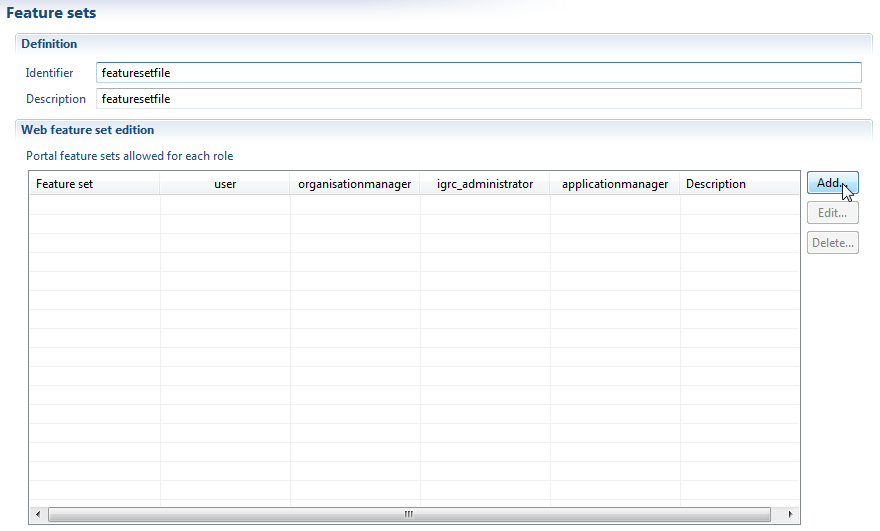  

To create a new featureset you will need:  

- A name or identifier
- A description

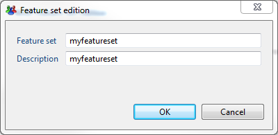  

Once created, you will see the featureset displayed in the list. And you will notice that there is one column per existing role in your project:  

  

To assign the featureset to any of the roles, it is enough to click on the empty cells. A green check will appear. This means the role will contain all the features in this featureset.  
You can create as many featuresets as you you need. They will appear automatically in all ".features" files of the project so that you can include features to it.

## Roles

Finally, the roles are declared in ".roles" files located in webportal/features.  

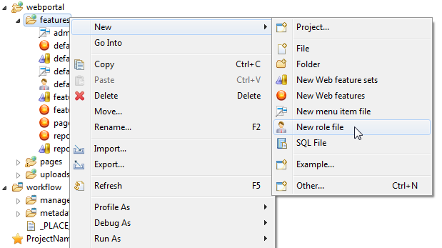  

A roles file creation wizard will walk you through the process. First a filename:  

  

Then we will need an identifier and a description for the file.  

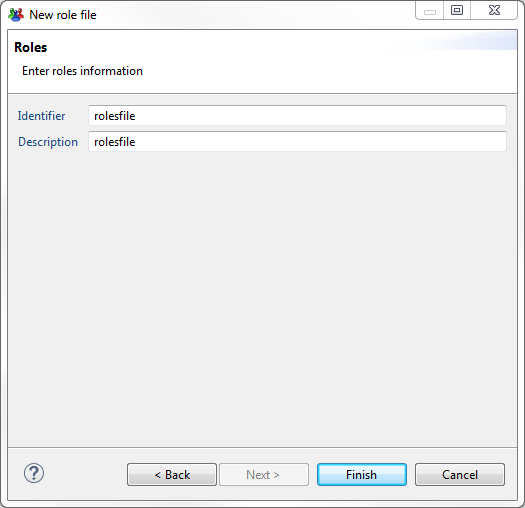  

Now you can add a new role by clicking on "Add..."  

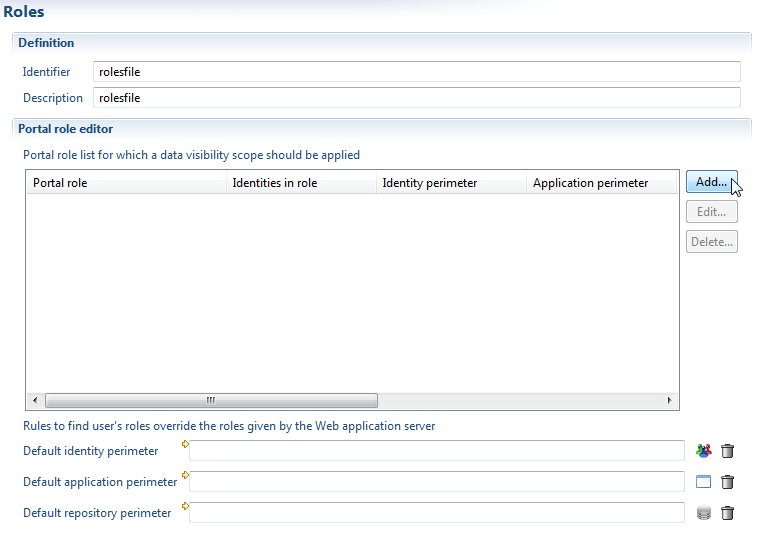  

To create a new role, you will need:  

- A role name or identifier (required)
- A description for the roles (optional)
- A set of rules to describe the role and its perimeters (Optional)  

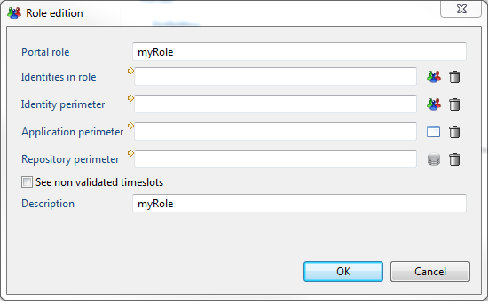  

## How to Assign Users to the Roles ?

Well, we have basically two options to assign users to roles:  

- By using a Rule that returns Identities
- By assigning the role using the web application container server ( Tomcat, for example )  

It is important to know that only one of those two options must be chosen for **each** role. Using both is **not** compatible.  

The priority is given to the method of assigning a rule.  

If you assign a rule to a role in a roles file, then this role will only contain identities in this rule. If the role is assigned by the application container (Tomcat, for example) , that configuration will be **ignored**.  

Tomcat roles that don't exist in the project will be ignored.  

### Using the Application Container  

In tomcat for example, the roles can be defined in configuration file tomcat-users.xml  

### Using Rules

Using rules allows to assign users to a role based on certain conditions.  

All rules that return Identities are supported. So you can use the filtering of the rules editor to chose identities based on :  

- Their job title
- Their organisation
- Many others...  

You can use one of the default rules or you can create a new one.  

After, to assign it to the role , all you need to do is to edit the role in the roles file and change the **Identities in role** by clicking on the icon:  

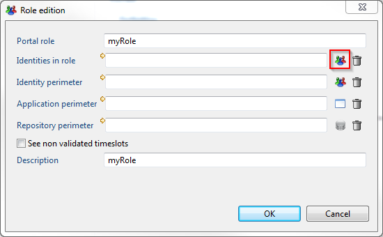  

Then you can select one of the available rules. For example the roles that returns **Organisation Managers**  ( Based on job )  

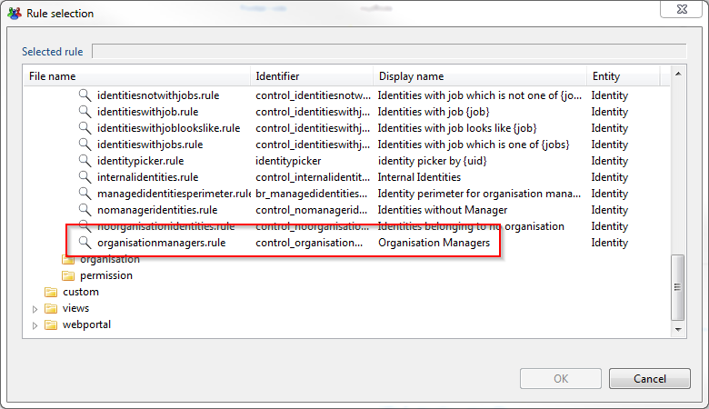  

## What About the web portal menus?

When the user log in the web portal, he has access to one default menu called 'Home'.  
You can add other menu entries through the access rights management.  

In order to do this you have to declare 'menu items' in your configuration:  

  

A menu item will appear if the current user has access to the corresponding feature within its roles.  
The menu item will be positioned left to right, depending on its priority. A menu item is linked to a target page.  

  

The menu configuration is stored as a series of files within the /webportal/features/ subdirectory.  
Menu item declaration files end by .menuitems  

## What About the Perimeters?

You probably noticed that we can also configure each role to define perimeters:  

- Identity Perimeter
- Application Perimeter
- Repository Perimeter

We can assign rules that return Identities, Application and Repositories.  

If we do, we define a perimeter for users of this role. The perimeter can be used from the view editor, we can configure a view so that it enforces the perimeter of the user.  

For example, if a view returns Identities and we enforce the perimeter then:  
The user will only be able to see the identities inside the perimeter.  

In order to to so, you have to activate the perimeter restriction in your view through the 'Toggle [concept] perimeter visibility' option.  
A funnel will then appear next to your concept.  

  

This can be useful for example for a manager of an organisation, we can define a perimeter with only people of the organisation that is managed.  
Like that, the pages and reports that the manager can see, will only show his team.  

To do this, we will need to create a rule with a parameter **principalUid**  that will contain the uid of the connected user. Then:  

  

This rule will return the list of people in the team of the manager with the uid **principalUid** ( The connected user), if any.  

And finally, assign this rule to the Identity Perimeter of the role by clicking on the icon:  

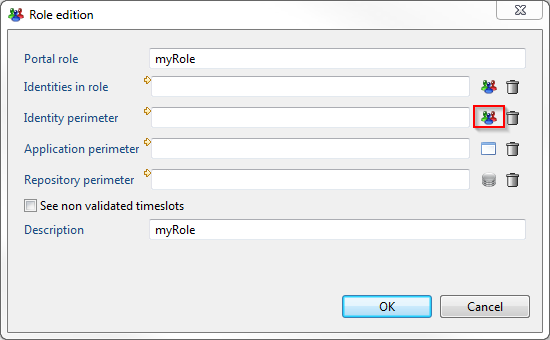  

For the roles having no associated perimeters, the "default identity perimeter" (same for application and repository perimeter) is used.  
If no default perimeter is defined, then no perimeter applies and the user will see all the database (identities, applications or repositories).  

If a default perimeter is defined then the union of all the perimeters (including the default one) will apply.  

Troubleshooting the perimeters :  
If you see objects in the protal whch should have been filtered, then you should do the following checks :  

- In the `igrcportal_login.log` file in tomcat logs,check the effective roles of your user.
- for each role, check that you have a perimeter that applies
- if one of your role has no associated perimeter, check the default perimeter.  

  

As of version 2017 R2 SP6, it is possible to use additional parameter in the rule defining the role perimeters.  

- Create a view to get an attribute that will be used as parameter in the perimeter rules
  - This view should refer to the connected user, using the `uid = principalUid`

> Do **not** make the view parameter *optional* (`uid [ = principalUid ]`), as this can cause performance issues: the view can be called without parameter and return **all** identities (can happen during report generation)  

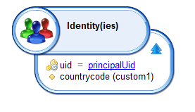  

- This view should be added to the technical configuration (user.perimeter-params.view)  

  

- This view contains the attribute needed for the perimeter rules. This attribute should be renamed to have a unique nickname (_i.e.:_ `countrycode`)  

- Create the rule that will be used to build the perimeters
  - this rule should use the view attribute as a parameter (_i.e.:_ repository code is `countrycode`)
  - in the rule displayname, it is mandatory to display this parameter  

  
