# Review wizard build and migration

> [!warning] This documentation applies to reviews created and generated with **Ader** or newer versions of iGRC product. If you have a review generated with the version **2017** of iGRC please refer to the following guide [Migrate review to Ader](./05-migration) to migrate your review.

## Overview

Once the wizard dialog is closed and the files are copied into the project folders, the view editor is opened.

In this editor, you, as the review designer, define the behavior of the review (what is displayed, what are the details tabs, how many reminders, when to escalate...)
This editor and all its tabs is described in [Review wizard editor](./03-editor) chapter.

When you are ready to generate the review from all your settings, you can switch to the Build tab.

The following screenshot shows the Build tab:

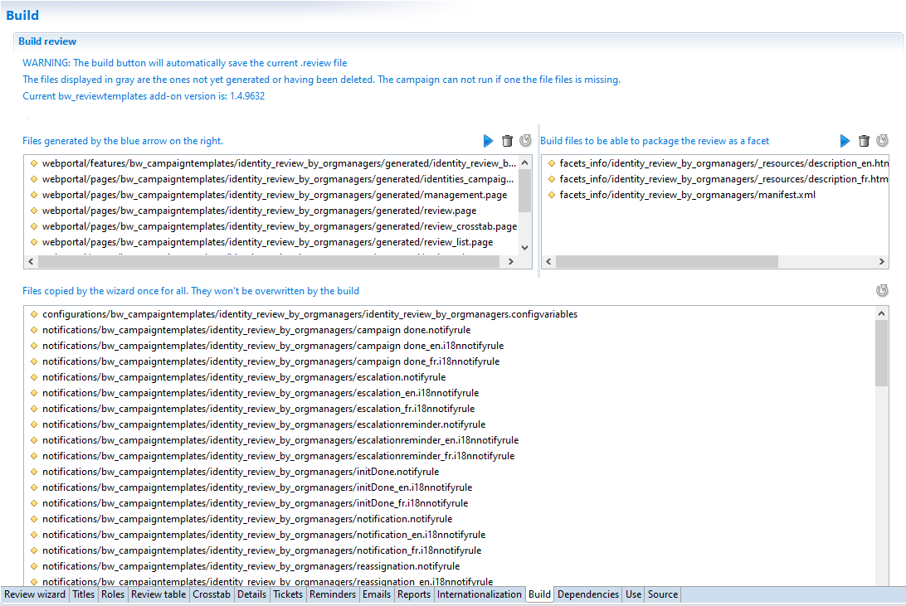

The upper left table has an icon to build the review .

Building the review means that all the settings entered in this editor are used to generate the workflow files and the associated pages for the user interface.

When you press this button, all the files shown in the upper left table are generated and copied to your project if it is the first time you launch the build, for the future builds the product always tries to check if there is differences between new generation and previous one to modify only changed files (this functionality allows a user to keep his customizations and get automatically added content due to generation)

> When launching a build the product will save automatically unsaved changes before performing the build.

## Version of bw\_reviewtemplates

The fact of knowing the version of `bw_reviewtemplates` add-on used for generating is very important, you can have in the same project several reviews that can be generated based on different versions of `bw_reviewtemplates` add-on, the version of `bw_reviewtemplates` add-on used for generation is shown on top of Build tab in the review editor.

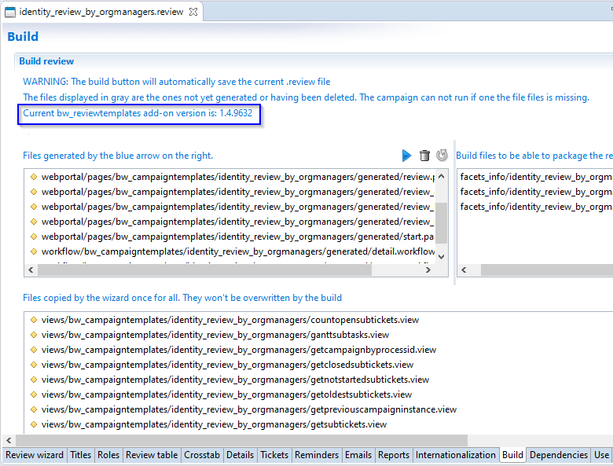

The version mentioned in the above image can be different from the installed version in the project, it should be always less or equal, for example if you install `bw_reviewtemplates` 1.4.9632 and you create a review and after that generate the review, the used version will be 1.4.9632, if you upgrade `bw_reviewtemplates` in the facet manager to version 1.4.9641, the version used in the review will still unchanged (see next image) because it always refers to what version the previous build is based on.

If we launch another build after upgrading to `bw_reviewtemplates` 1.4.9641 for example (upgrade through facet manager) the version used for review build will change from 1.4.9632 to 1.4.9641 at the end of generation, in that case we are performing a migration of the existing review from using `bw_reviewtemplates` 1.4.9632 templates to using the `bw_reviewtemplates` 1.4.9641 new templates.

The version of `bw_reviewtemplates` add-on used for review generation is stored on generated file `workflow/bw_campaigntemplates/reviewname/generated/master.workflow` file, so each generated review can have a specific version number.

> [!warning] This tag value is only used and updated by the product.

Please refer to [review migration](#templates-migration). topic for more details about migration.

## Review Build results

At the end of each review generation a dialog box showing generation result will be appear, the dialog contains the following information:

- **Number of new files:** we can have new files that will be added to the review for example if we upgrade to newest `bw_reviewtemplates` that include new files comparing with previous version.
  
- **Number of conflicting files:** number of files where the product couldn't merge the existing file and the generated one due to complexity, for example if the user adds content to a file (add some codes at line X of a page) and the new generation adds another content to the same file at the same line X, in this situation it returns to the user what version he needs to keep or merge the two versions using merge tool (for more details refer to **[Resolving conflicts](#resolving-conflicts)** topic).
  
- **Number of successfully merged files:** Number of files where the product has successfully merge the existing files and the new generated files (for more details refer to the **[sample showcase - Keep user customizations after a build](#keep-user-customizations-after-a-build-sample-showcase)**).

If no dialog is shown at the end of the build it means that review generation hasn't affect any review files, files content was not changed comparing with the content of workspace.

If you click on "OK" you will be redirected to **review generation merge tool**, this editor will be detailed in [Review generation merge tool](#review-generation-merge-tool) topic.

In the next image we illustrate generation result after review migration from `bw_reviewtemplates` 1.4.9632 to 1.4.9641
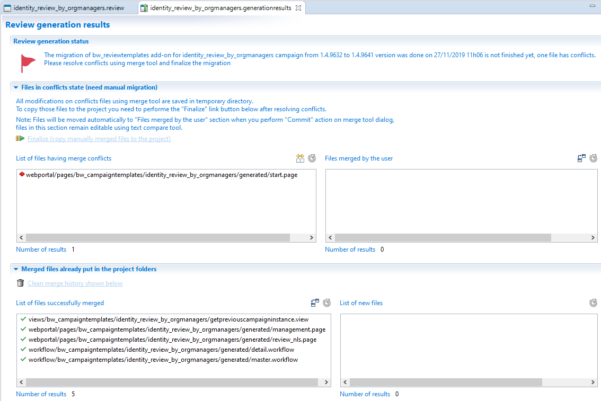

If you come back to the review editor you will notify a flag with a specific color (red/yellow/green) and explanation text that inform the user about the state of the generation, if you click on the link you will be redirected to the **review generation merge tool** shown above.

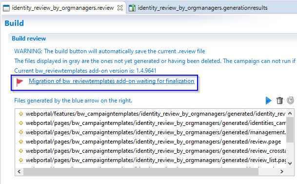

## Reference review

Each time the user launches a review build the product will store a copy of current review file under `library\referencereview\reviewname\reviewname.DO_NOT_DELETE`, this file is very important for the future review build and should not be deleted or edited manually, be sure when you share the review with other persons to have this file in the export, if you share your review by exporting it as a facet this file will be included automatically in the facet because it is always under `/reviewname/` folder

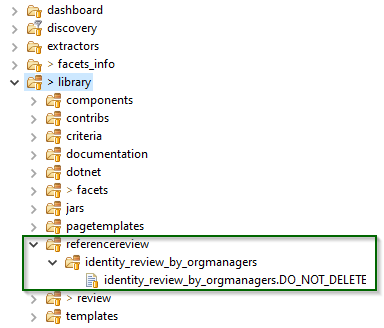

## Review files categories

As you can see in the following image, the files of a review can be classified in two categories of files, those files come from the review templates add-on(`bw_reviewtemplates`)

1. Generated files
2. Static files

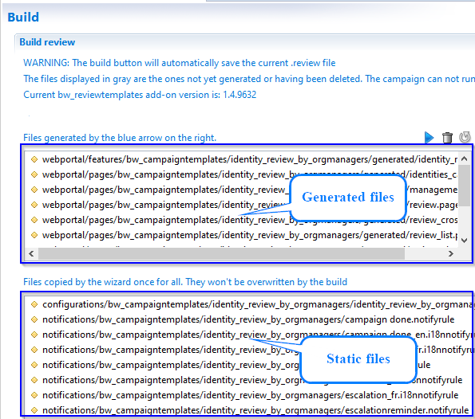

In general generated files list contain:

- workflows
- pages

And static files list contain:

- notifications
- rules
- views
- reports
  
> The above classification is not an absolute rule to know whether a file is generated or static, refer to the upper left and lower tables in the Build tab to get the exact list of generated and static files. This list may also vary with the `bw_reviewtemplates` add-on version.

### Generated files

List of files that will be generated at the first build after wizard creation ( build the review ), for the future review generations the product always tries to see if current review files in the workspace has changes comparing to the files from new build and if it is the case (example: user customize generated pages after the first build) the product tries to keep the user changes and adds only the new content coming from new generation (example: if the user makes changes to review settings generated files will contain some differences comparing with the previous build)

> Generated files are always under a folder having "generated" as name.

### Generated files life cycle

Generated files can be modified through different ways, when launching a build(excepting first build) the product always tries to compare the current content of review files in the workspace and the content of files from the new build, if differences are detected the product will try to merge between the current files in the workspace and the new generated files to keep changes done on those files, changes can be done for example by the review developer (changes done directly on generated files), the new generated files can be different from the last one (previous build) for example if the review developer changes review settings or upgrades the templates (build after upgrade of `bw_reviewtemplates` facet).

In some cases the product can not merge files automatically due to the complexity, in this situation the user is asked to complete the merge manually through the **[review generation merge tool](#review-generation-merge-tool)**.

To see how to resolve a conflict through the review generation merge tool please refer to [**Resolving conflicts**](#resolving-conflicts) topic.

The following image will show the different actions that cause modifications on generated files and what is the impact of each operation on the existing generated files of the review.

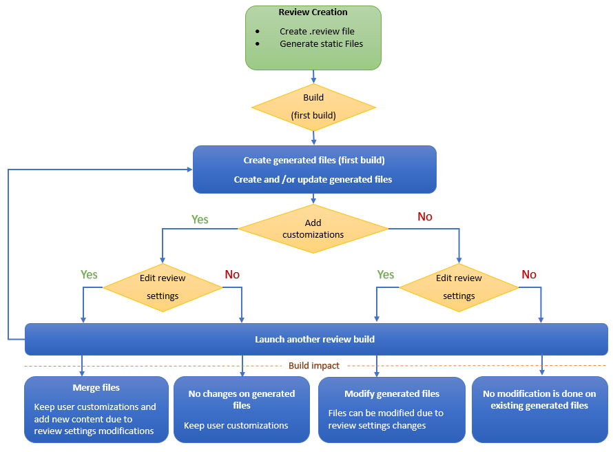

> customizations are the modifications done on generated files directly and out of the review build process (example: edit generated pages manually).

### Static files

Files that have been copied once for all when the wizard dialog was validated, those files will not be re-generated when you build the review with the same version of installed `bw_reviewtemplates` add-on.

This files can be customized by the review developers, if review build is launched after an upgrade of `bw_reviewtemplates` add-on, it is possible that static files change, the product will try merge between the customizations and modified static files due to `bw_reviewtemplates` add-on upgraded.

For more details about review migration refer to [Review migration](#templates-migration) topic.

### Static files life cycle

Static files can be modified also through different ways, when launching a build after an upgrade of `bw_reviewtemplates` add-on the product try to compare the current content of static files and the content of files from the new build (files modified due to `bw_reviewtemplates` add-on upgraded), if differences are detected the product will try to merge between the two versions.

Generated files can also be modified due to a templates modification after an upgrade of `bw_reviewtemplates` add-on.

In some cases the product can not merge files automatically due to the complexity, in this situation the user is asked to complete the merge manually through the [review generation merge tool](#review-generation-merge-tool).

To see how to resolve a conflict through the review generation merge tool please refer to [Resolving conflicts](#resolving-conflicts) topic.

The following image will show the different actions that causes modifications on static files and what is the impact of each operation on the existing static files of the review.

> customizations are the modifications done on generated files directly and out of the review build process (example: edit generated pages manually).

### Conclusion

To sum up, here is a table explaining at which step the files are created and can be modified by the product:

| Type          | Extension   | Category  | Copied when                            | Modified(merged) by the product                                        |
| :------------ | :---------- | :-------- | :------------------------------------- | :--------------------------------------------------------------------- |
| notifications | `.notifyrule` | static    | wizard dialog is validated             | build after `bw_reviewtemplates` migration                             |
| rules         | `.rule`       | static    | wizard dialog is validated             | build after `bw_reviewtemplates` migration                             |
| views         | `.view`       | static    | wizard dialog is validated             | build after `bw_reviewtemplates` migration                             |
| reports       | `.rptdesign`  | static    | wizard dialog is validated             | build after `bw_reviewtemplates` migration                             |
| workflow      | `.workflow`   | generated | first time the build button is pressed | build after changing review settings or `bw_reviewtemplates` migration |
| pages         | `.page`       | generated | first time the build button is pressed | build after changing review settings or `bw_reviewtemplates` migration |

> The above table is not an absolute rule to find out which file is copied once and which file is generated each time the Build button is pressed.
Please, refer to the 2 (upper left and lower) tables in the Build tab to get the exact list of files copied once for all or generated each time you press the Build button.  
> This list may also vary with the `bw_reviewtemplates` add-on version.

## Keep user customizations after a build (sample showcase)

Since the Ader version the generation will not overwritten files already generated, so if you customize files of a review that was generated in the past (pages, workflows, ..), a new generation will kept the customizations and set only the difference comparing with last generation.

In the next example we will show a customization of a generated file out of the build process and how the customizations will be kept after a second generation, the example will focus on `review_list.page` generated file, we will follow the next steps:  

- Generate the review without doing changes.
- Add some customizations to `review_list.page`.
- Add new attributes to the review list from through review editor (changing the .review file).
- Do a second generate.

### First review generation

Generating review without doing changes on the .review file, the generated `review_list.page` is based on the settings shown in the next image.

### Customize generated files

we will add two variables to `review_list.page` that will be used to do some customizations in the page.

- project_variables_validate of type **Boolean**
- project_variables_status of type **String**
  

### Change setting from review editor

We will add new attributes to the review list from the **Review table** pane of review editor, attributes that we will add are:

- `identityarrivaldate`
- `identitydeparturedate`

### Second generation

Launch a generation after adding the two attributes, this modification will add two variables to the page, this variables will be mapped in tables.

In the next image we show the resulting `review_list.page` after the second generation, we can see that the product has merged the two versions (the version customized by the user and the version issued from current review build)

## Templates migration

The  `bw_reviewtemplates` add-on is the main add-on for the review generation, this add-on can be modified by **RadiantOne** for multiple raison, for example:

- Make improvements to the templates (view, rules, pages, ...)
- developing new review features
- Bug fix

So if you have used 1.4.9632 version of `bw_reviewtemplates` to generate your review, and you wish to integrate improvements and new features added to the version 1.4.9641 without losing customizations done on current existing review files you need to perform a migration.

> [!warning] If you are trying to upgrade your review from using `bw_reviewtemplates` add-on X version to Y version, so it is highly recommended to keep the .facet file reflecting to the X version in library\facets folder, otherwise the risk of having a lot of conflicts will be important at the end of the migration.

The next paragraphs explain how to migrate `bw_reviewtemplates` add-on from current version to a newer version:

### Facet Upgrade

First thing you need to do is downloading the latest version of `bw_reviewtemplates` add-on, after that put the facet file in projectDirectory\library\facets and finally upgrade it through the facet manager as shown below

At this time files(templates) of the newest add-on was copied to `project_directory\library\review folder`, files of generated reviews are not changed for the moment.

### Build review after upgrade

To migrate your existing review files you need to do a build after the facet upgrade (above operation), the product will detect automatically that the installed version of `bw_reviewtemplates` is higher than the version used for the last review build.

In this situation when you click on the build button a dialog will be shown to inform the user that review upgrade is needed and it will be done automatically after confirmation.

At the end of migration you will notify that the current bw_reviewtemplates add-on version has changed from 1.4.9632 to 1.4.9641.

Please refer to [Build result](#review-build-results) topic for migration results and [Review generation merge tool](#review-generation-merge-tool) to see how to handle results.

## Review generation merge tool

At the end of each review generation (except when no modification is done) a dialog box showing generation result will be appear, this dialog contains statistics about what the build has done on review files.

After performing OK button you will be redirected to **review generation merge tool** editor, this is a temporary tool that shows information about the review generation / migration, list of conflicting files, see the well merged files and what the modifications that the product done on existing files, ...  

It provides a merging tool to resolve conflicts if exist and finalizes the generation by copying the manually merged files to your project, in the next image we will explain the different information shown and possible actions on this editor.
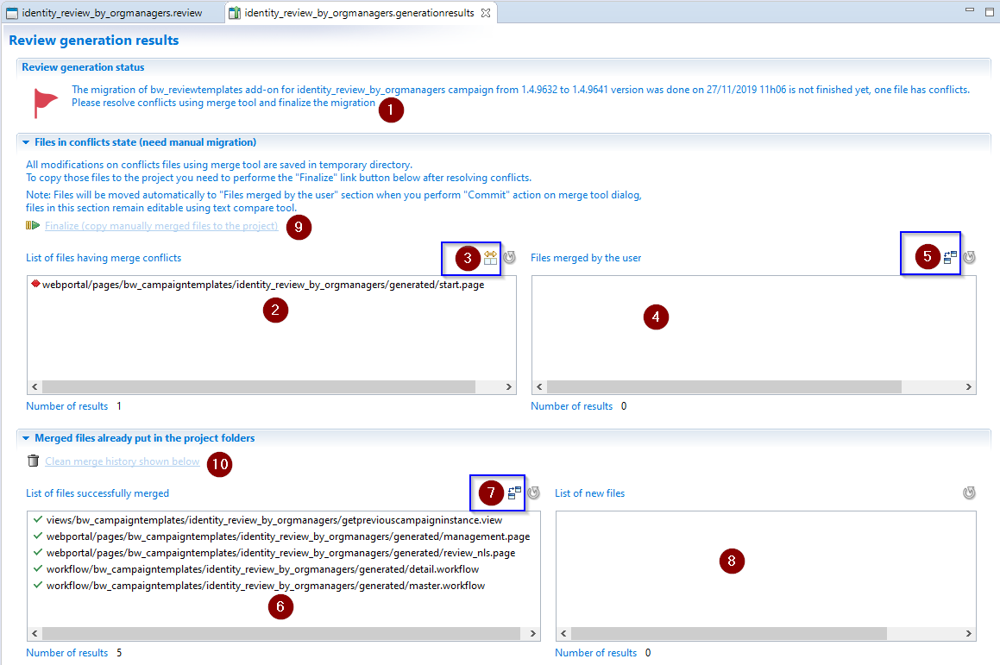

1. **Status of the generation:** show general information about the generation and the current state ( generation in conflicting state,  generation waiting for finalization, generation finished)
2. **Conflicting files:** List a file where the product couldn't merge files automatically, user needs to complete the operation manually (for example using merge tool see next option)
3. **Merge tool:** this option will open merge tool on the selected file, it allows to see the part of the file that are in conflict and allows to merge and commit the modification done
4. **User Merged files:** list of files merged and validated by the user, files are put automatically in that table when the user commits modifications done to resolve conflict (committing from the option above)
5. **Compare tool(editable):** this option will open a tool that allows comparing with previous version, you can see easily the modifications done at resolve conflicts operation, edition is allowed at this level.
6. **Already merged files:** list of the files merged automatically by the product, and already put in the project's folder, no operation is allowed on those files through the compare tool(read-only).
7. **Compare tool(read only):** this option will open a tool that allows comparing with previous version, you will see easily the modification done by the product on the previous version of the selected file.
8. **Added files:** list of new files added to your project, those files didn't exist in the previous `bw_reviewtemplates` version.
9. **Finalize:** this option allows to finalize the generation by copying the manually merged files to your project folders, this option is enabled only when the user finishes resolving all existing conflicts.
10. **Clean:** this option is enabled only when the generation has successfully finalized, at this moment all merged files are already copied to your project and no need to keep this review generation result (no operation is possible only read action is allowed), so the clean option will delete the current merge tool and all temporary files and folders created for the tool(delete **.generationresults** and related directory from **logs** folder).

> [!warning]
>
> - The review generation merge tool will create a temporary git repository in your project, this repository will be automatically deleted when performing `10. Clean merge history below option`.
> - The files in `2. List of files having merge conflicts` and `4. Files merged by the user` are stored in a hidden temporary directory under logs folder, please don't clean your logs directory before finalizing your generation in case of merge conflicts.
> - The files shown in `6. List of successfully merged` and `8. List of new files` tables are already put in your project.

### Different generation states

If you launch a review build without any changes to the review settings (.review file) and with same `bw_reviewtemplates` add-on version no changes will be done on your files by the product, otherwise the review will always finish with one of the two following states:  

1. **Build in conflicting state:** generation are not yet finished, there is one or several files having conflicts.
2. **Build Waiting for finalization:** this is an intermediate state, it happens when the user resolved all build conflicts and hasn't performed the finalize operation yet to copy manual merged files to the project folders
3. **Build finished successfully:** no actions needed, the review generation merge tool is shown just for read-only purpose.

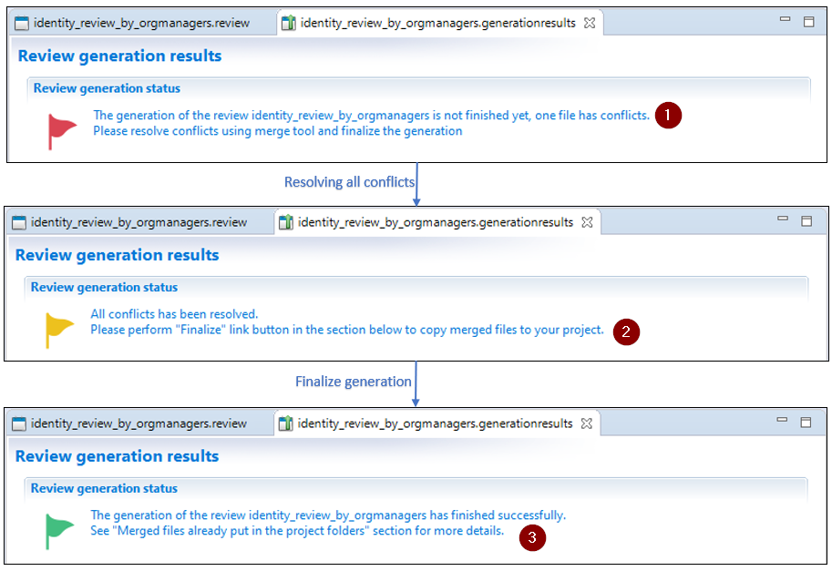

### Resolving conflicts

A review generation can terminate with conflicts which require user actions. It happens when files cannot be merged automatically.

The review generation merge tool provides three technical ways to resolve conflicts, you are free to choose the action to perform according to your case (Keep my version, replace current version by the generated one, merge the two versions)

1. **Resolve conflicts using merge tool**
2. **Keep current version in the project**
3. **Replace with generated version**

#### Resolve conflicts using merge tool

This tool is based on Eclipse Egit merge tool, the merge editor show the current version of the file in the left pane and the version to be merged (version generated by the current build) in the right pane
  
You have to edit the working tree version (current version in the project) until you are happy with it, when finish editing you need perform commit button after that the conflicting file will be moved automatically to `File merged by the user` table.

In the next picture we will highlight on most important parts of this merge tool and we will illustrate a conflicting file having(conflicting changes, non conflicting changes and preserving user customization).

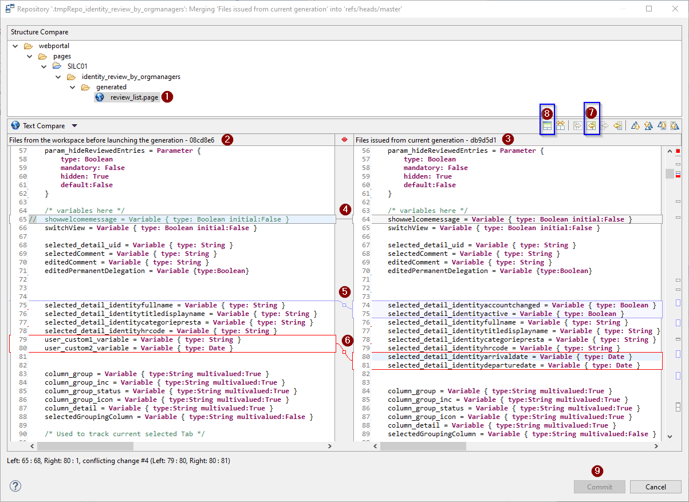

1. **File name:** the file having merge conflicts.
2. **Left pane:** shows the working tree version (current version of the file in the project).
3. **Right pane:** shows the content generated by the current review build.
4. **Changes not merged:** User has customized this line (he commented the line), so this customization will be kept, the merge tool highlight the line with grey color to show that there is a difference.
5. **Non conflicting changes:** non conflicting changes (highlight in blue color) are generally new content to add to your file, to add all non conflicting changes you need to perform option .7
6. **Conflict:** conflict happens when we have two changes at the same place comparing with previous generation, the changes on the left pane are done by the user and on the right pane are done by the generation engine, at this situation the user have to decide if he needs to keep the two versions by grabbing the differences from right to left, keep his version(left pane) or replace his version by the generated version(right pane).
7. **Copy of non conflicting changes:** this option allows to copy all non-conflicting changes (highlighted in blue color) from right pane to the left pane.
8. **Ancestor pane:** this option allows to Show/Hide Ancestor pane, this pane contains the version of the file after the previous generation (before the user changed the file manually), so showing this pane can be helpful to understand well the difference between changes in left and right pane.
9. **Commit:** use this button to validate your modifications, after this validation the file will be moved from  `List of files having merge conflicts` table to `Files merged by the user` table.

To copy the current selected change from right to left you can use the option shown below

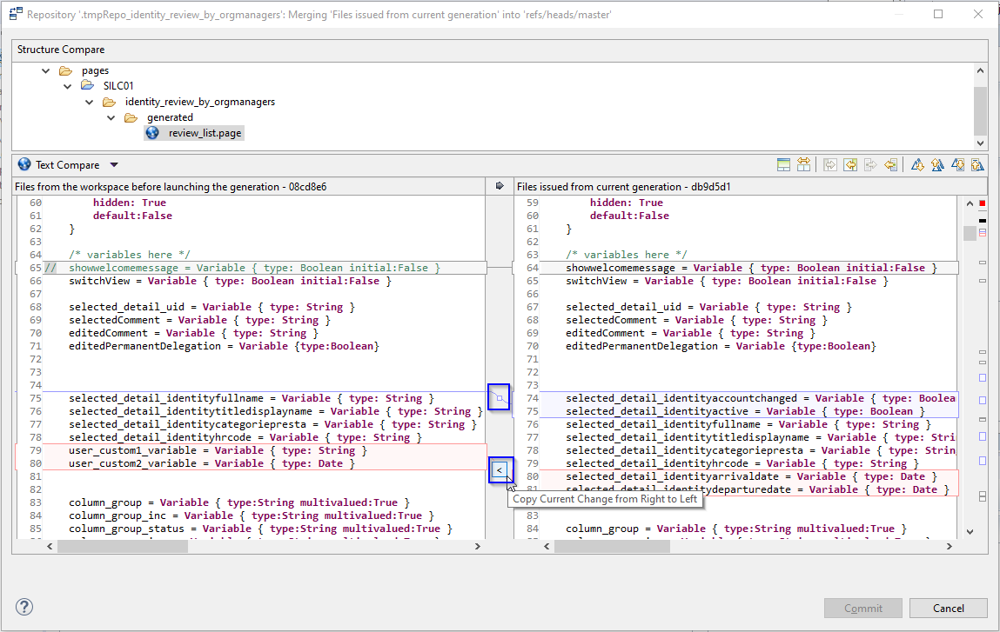

#### Keep current version in the project

The keep current version in the project will remove the current file from conflicting list, this action will not affect the current content of the file in your project.

#### Replace with generated version

Replace with generated version will commit automatically the generated version and move it to `Files merged by the user`, at this step the file is still unchanged in the project, it will be overwritten by the committed version only when you perform `Finalize` operation after resolving all conflicts.

> if you are confronted to complicated conflicts, the best way is to use **Replace with generated version** option and after that using the compare tool on `Files merged by the user` take only the changes from current version of the workspace to the generated version, like that you minimize the risk of conflicts on this file in the future builds and templates migrations.

### Waiting for finalize generation

This is an intermediate state, it means that all generation conflicts are resolved and you can copy the merged files to the project, files at this situation are stored in temporary directory.

### Finalize generation

This operation will copy the files from `Files merged by the user` to replace the files in your project, at the end of this operation this list of files will be moved to `List of successfully merged` table, at this situation no action on those files will be possible, the only option is to consult the changes done through the text compare tool, at this situation you can clean the temporary working directory.

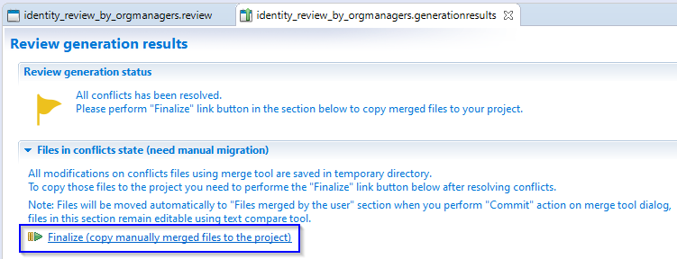

## Clean temporary working directory

After finalization of the review build, the **Review generation merge tool** is still available for read-only purpose (to see easily the modification done to the previous generated files), if you don't need it anymore you have to perform `Clean merge history shown below` action to delete the generation result file and related temporary working directories and files(all those files are stored under the logs directory of the project).

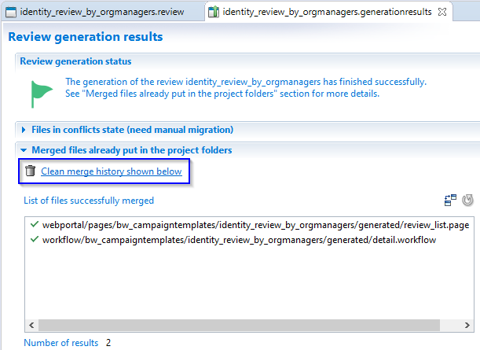

Files that will be deleted when performing **Clean temporary working directory** are:  

1. Generation result file `logs/REVIEW_NAME.generationresults`
2. working directories `logs/.REVIEW_NAME folder`
3. Temporary git repository

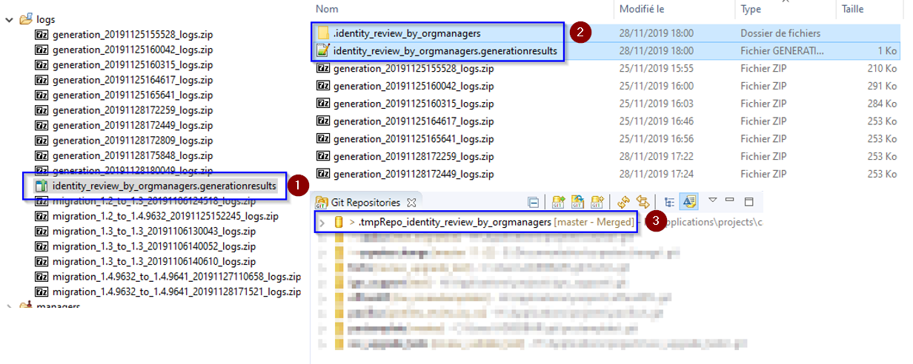
