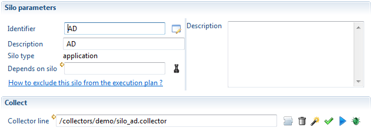
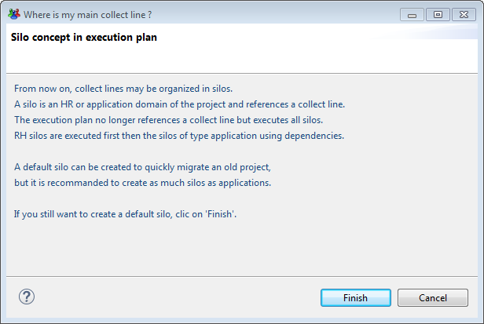
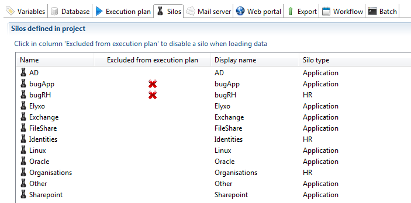
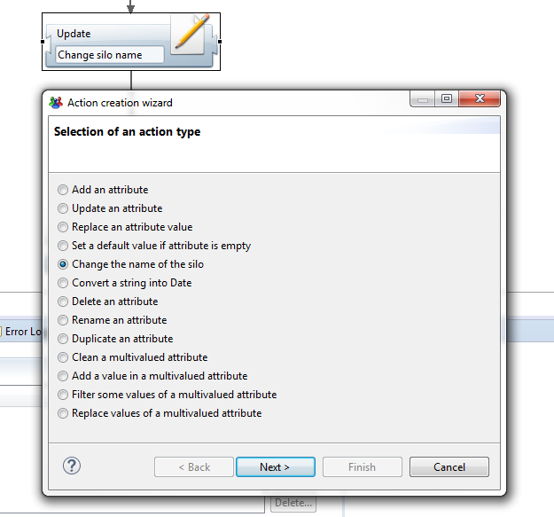
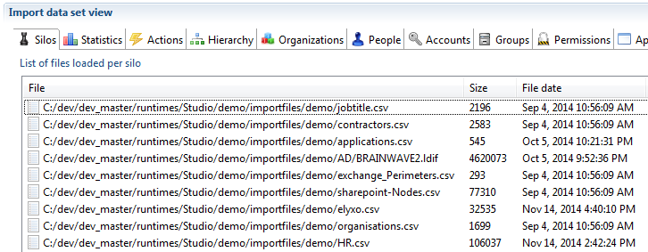
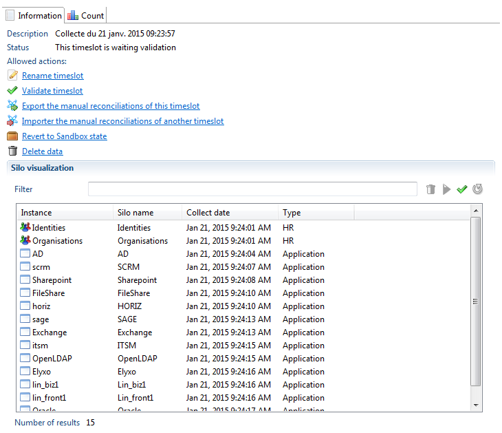

# Silos

## Overview

In previous versions of the product, all data files were collected as a whole. There was no way to delete all data related to an application or a repository like SAP (accounts, groups, rights, permissions,...). The whole sandbox or timeslot is deleted.  

In the new version, you can define different silos (for example one per application) and run the collect so that each data stored in the Identity Analytics database (account, group, permission,...) belong to a silo.  

The Timeslot view of the product displays the list of silos collected and you can delete just one silo and reload it after modifying the collect line.  

This is just an example of what can be done using Silo. This new concept offers the following benefits:  

- Silo definitions let you organize your collect in a declarative way. By just looking at the silo definitions, without editing the complex collect lines, you can have an overview of all data collected (HR data, repositories and applications)  
- Silos can be deleted then collected again without having to destroy the whole sandbox. Very handy in the first steps of the project when debugging an application collect line. No need to reload other repositories or HR data  
- Silos bring input data file validation. For each silo, you can define some constraints for the input file and decide, by configuration, to skip it if the data files do not respect input format. This allows execution plan to continue even if a non important application can not be collected.  
- Silos can enumerate files from a folder which simplify the collect line. No need to use a file enumeration component as a source. This is useful to have a dynamic behaviour depending on files found in a folder (for example one file per AD domain)  
- Silos have dependencies between them. The product automatically determines the order to use to collect silos. It means that the main collect line which calls all other sub-lines is not needed any more.  
- Using silos, it is easier to make a facet which run immediately after installation. The facet includes the silo definition and is automatically part of the execution plan.  
- Including or excluding a silo from the execution plan is done in the configuration (dev, prod,...). This way, you don't have to change a collect line to do that.  
- Some constants may be defined in the silo to be used in the collect line. Defining a computed attribute in the discovery for an application name or the repository code is not needed any more.  
- The name, the length and the last modification date of all the files opened by any collect lines are stored in the Ledger while the execution plan is running. Nothing to do to activate this feature.  

## What is a Silo ?

This is a file with a .silo extension in the silos folder. A silo has a name and refers to a collect line. The main collect line for the project does not exist any more. When running the execution plan, the product enumerates all silo files in the silos folder and run the associated collect line.  



Of course, the collect line referenced by a silo may still call sub-lines. For example, SharePoint silo refers to a SharePoint main collect line which calls 3 sub-lines to load nodes, groups and rights.  

## Silo dependencies

The silo definition also includes an optional dependency to a parent silo. It is very important to fill this information. For example, we can define a silo to collect AD. Then define a second silo to collect SharePoint. But SharePoint collect will fail if run before AD collect. To avoid this problem, we declare that SharePoint depends on AD. This will ensure that AD silo will be collected before SharePoint silo.  

HR data is not different than any other data. It should be collected using a silo. You may have several silos for collecting all HR data. For example, a silo for organizations, a silo for employees and a silo for contractors. The silos for employees and contractors should depends on the silo for organizations because organizations should always be the first data to collect.  

In projects, HR data (organizations and identities) must always be loaded first. Then come the repositories and the applications with depend on HR data.  

To simplify silo definition, all repository and application silos implicitly depend on HR silos.  

When you create a silo using the creation wizard, you have to select a silo type (either HR or application) as shown in the following screenshot:  


This type of silo is used as a first level of dependency. This dependency is implicit.  
When running the execution plan, the product loads the data in 2 phases: all the HR silos first, then all the Application silos.  

In the silo definition, you can add an explicit dependency between 2 silos which have the same type. For example, the silo for employees (HR type) may depend on the silo for organizations (HR type). Also, the silo for SharePoint (Application type) may depend on the silo for AD (Application type). These explicit declarations in the silo editor are the second level of dependency.  

The following diagram shows an example of the dependencies between silos:  


The best practice for silos of type Applications is to separate the repository level (repository, accounts, group) and the application level (permissions, applications and rights) as shown for AD and SharePoint.  

This is not always possible depending on the input data files. Splitting data into a repository silo and an application silo has many benefits (debug only the application while keeping the repository in the Ledger, project documentation with all functional parts being declared,...)  

> [!warning] Missing dependencies or wrong dependencies may result in an error in the collect or activation step. Let's assume that the dependency between SharePoint and AD is not defined in the SharePoint silo. There are 2 common use cases where the missing dependency will trigger an error:  

First use case: the execution plan determines the order of the collect to run. As there is no dependency, the product may choose to run SharePoint before AD. The collect of the SharePoint rights will fail if some nodes (sites, folders, documents,...) are granted to AD groups which have not been collected.  

Second use case: the product decides to collect AD and SharePoint in the right order. Before activation, you check the data in the Ledger and find that AD needs to be dropped and collected again. You delete AD silo. Without dependency declaration, the product won't delete SharePoint. Then AD is collected and the activation is run. The activation will fail because all SharePoint references to AD are wrong.  

> [!warning] take the time to carefully define the dependencies as it is VERY important to safely collect data.

## Converting an old project to use silos

Old projects do not have any silo declarations. After importing an old project into the version 2015 of the product, you should create silos. There are 2 ways to do that.  

You can define manually all the silos corresponding to HR data and application data. This is of course the best way to get an up to date project which uses the latest features of the product.  

But it may take some time to accomplish and maybe some work on the collect line, needing to check if no bugs have been introduced.  

This is why the product offers another way which is safer to migrate an old project: define only one silo which points to the main collect line that was specified in the execution plan.  

Of course, you loose all the benefits of the silos by having just one. In this configuration, the product behaves like the product version 2014.  

If you choose the easiest way with only one silo, you can ask the product to generate the silo for you. To do that, open the current technical configuration and select "Execution plan" tab.  


Click on the link "Where is my main collect line ?". This will open a dialog box offering you the option to create a default silo:  


By clicking on Finish, the product generates a default silo with the main collect line.  

## Selecting silos to include in the execution plan

As the product automatically run all silos located in the silos folder during the execution plan, an option is provided to select which silos should be ignored.  

The list of silos appears in the technical configuration in "Silos" tab. In this list, you can click in the column "Exclude from execution plan" to disable a silo when running the execution plan.  



The important point to note is that you can define a different set of silos to exclude for each configuration. For example, Exchange silo could be loaded in Dev and not in Prod.  

## Iterating on several files

Some applications are typically static. For example to load a CRM application, you create a discovery, a collect line and a silo.  

But some others are dynamic meaning that the perimeter can change from time to time. This is the case with AD. If the customer has one domain per country, it would be clever to organize the collect so that, when a new country is opened, it is collected by just adding a new LDIF file in the extract folder (as long as the file schema is the same).  

In the previous version of the product, a special collect line would have been created to enumerate the LDIF file in the input folder. This collect line would have called the AD collect line for each file found.  

The silos simplify this operation. You can activate the "iteration" feature and specify the folder and the filter (`*.ldif` for example) to find the files. No need to make a collect line to do that.  

The product will enumerate the files and call your collect line for each file name found.  

The silo name, which by default is the name of the silo definition, can be overridden to create as many silos as imported files (in our example one silo per AD domain). To achieve this, two new configuration variables are filled out automatically: `config.siloIteratedFileFullname` and `config.siloIteratedFileShortname`. The first one will contain the full path of the file that is currently read, and the second one a shortened version containing only the name of the file without extension (usually name of the file will have to include information that allow to identify it, for instance the AD domain name).  

Those two variables can then be used in the expressions defining the silo name, or the silo constants (see further below), and also are available in all the collector lines to be used in javascript expression as needed.  

The iteration part in the silo editor looks like this:  

)

When iterating, the question is: how does the collect line know the name of the file to load (the LDIF file in the previous example) ?  

There are 2 answers to this question:  

1. If the main collect line of the silo has a discovery component as its main source, this is automatic. For each file found, the main collect line will be run and the name of the file processed by the discovery source will be overridden by the product.  
2. If the main collect line does not start with a discovery component (for example, if it uses a Start component), then in your discovery source component on your collect sub-lines, use `config.siloIteratedFileFullname` to force the file opened by the discovery.  

## Changing Silo name dynamically

You can change the silo name at any time in a collect line using a small piece of Javascript, or a dedicated modification action. This change will only affect the current collect line (see above for a mechanism that allows to override the silo name globally from the silo configuration).  
This can be useful when you need to compute the silo name from a path or from one attribute of the dataset, or if a file has to be collected into several silos.  

To do that, either use the action "change the name of the silo" in the update component  


or add a call to a Javascript function in a Modification filter. In this function, add something like:  

```conf
config.siloName = 'my silo name';  
```

### Using silo constants

In a collect, we often need to have constants in attribute to map to targets. For example, in an account target, we need an attribute containing the repository code. In the previous versions, we would have created a computed attribute in the discovery to add this constant or a modification filter in the collect line to add the attribute with the constant value.  

Now, in the silo definition, there is a section to declare some fixed constants. All fields are optional. In a silo collecting SAP accounts, you could define the repository code as SAP.  


In the collect line, all the constants are automatically added to your main dataset. You dataset contains the following attributes (the name of the attribute is shown as a tooltip in the silo editor):  

```sh
_APPLICATION_CODE_  
_APPLICATION_DISPLAYNAME_  
_APPLICATION_TYPE_  
_APPLICATION_CRITICITY_  
_REPOSITORY_CODE_  
_REPOSITORY_DISPLAYNAME_  
_ASSET_CODE_  
_ASSET_DISPLAYNAME_  
```

In the account target of the collect, when mapping an attribute to the repository code, you can select a constant from the above list.  

Of course, if you want to declare a constant not related to application, repository or asset, you still need to use the old way.  

## Working with silos in the Ledger

When the execution plan is running, all the names, length and last modification dates of the files opened by the collect engine are stored in the database. You can see the list of files which has been used to collect silos in the first tab of the Ledger in the studio:  


In the timeslot view, when selecting a timeslot, the product displays the list of silos which have been loaded.  


From the list of silos, you can:  

- check dependencies of silos (green check icon). This is a way to check if some dependencies, not declared in silo definition, are found in the data loaded in the database.  
- select several silos and delete them (trash bin icon). This will delete all the selected silos but also all silos which depend on the
- select several silos and reload them (blue array icon). This will delete the data of these silos and all the silos which depend on the selected ones then run the silo again to load data.  

The delete and reload actions work on both a sandbox and an activated timeslot. When these actions are performed on an activated timeslot, the timeslot is reverted to the sandbox state.  

A new link has also been added (called Revert to Sandbox state) to get back to the Sandbox state without changing any data in the Ledger (no delete or reload).  

When reverting to the Sandbox state, returning to the activated state is done using the usual "activate" link.  

> A validated timeslot can never be reverted to activated or sandbox state.  

In the project configuration editor, "Execution plan" tab, you find the blue arrows to run each step or to run all the step at once.  


The 2 actions under Step 1 (run silos) opens the same dialog box as in the previous version to create a new sandbox or select an existing one.  


If you choose to create a new timeslot, the product behaves like in the previous versions of the product.  

But if you select an existing timeslot, the product will find all the silos not yet loaded and will only run the silos needed to have a complete timeslot.  

It means that you can go to the timeslot view, delete some silos, declare new silos and collect then run the silo in the execution plan tab so the product add in the Ledger only what is missing.  

## Validation of input files

A mechanism of detection of invalid input files has been included in the discovery and the silos execution. There are 2 goals:

- If an input file is invalid, the whole silo can be ignored if it is not sensitive.
- All errors found in input files are logged in a different file for each silo. This way, sending the problems to the application owner is easier.
This feature is covered this article: [Data files validation](../timeslots-and-execution-plan/collecte-et-silos/input-file-validation.md).
