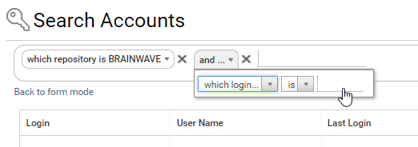
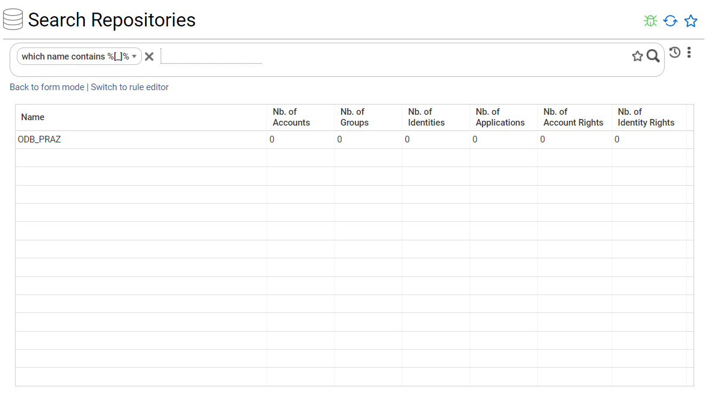
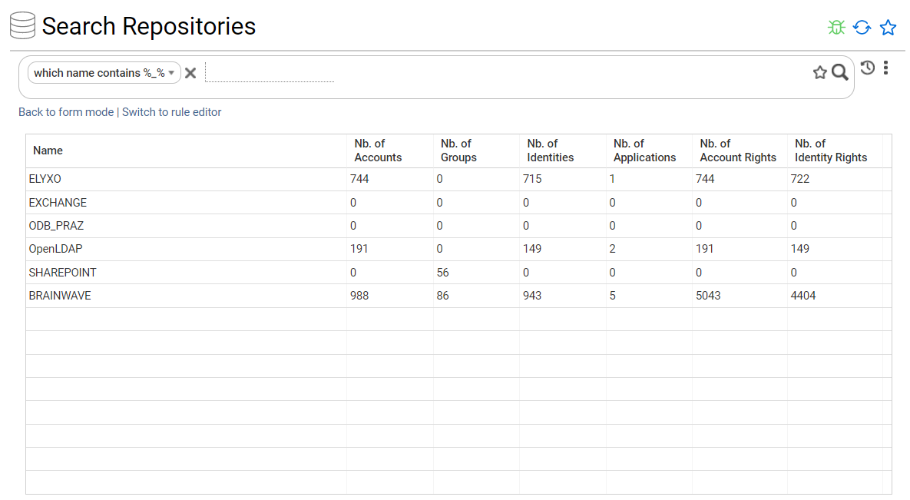

 
# Smart search

The SmartSearch feature allows the user to build constrained requests for the Ledger using predefined criterias.

You can find [here](./assets/SmartSearch_labels.csv) all available criterias. The structure is following:

|         Header         |                              Description                               |                 Example value                  |
| :--------------------: | :--------------------------------------------------------------------: | :--------------------------------------------: |
|        `Entity`        |                  Concept type returned by the request                  |                    Account                     |
|         `Type`         |                 Type of the request (criteria or join)                 |                    criteria                    |
|      `Criteria`        |                          Criteria identifier                           |                  eqIdentifier                  |
|       `Request`        |                 Request corresponding to the criteria                  | Account.identifier = '{identifierParam.value}' |
| `SmartSearch label EN` | English SmartSearch label corresponding to the criteria (if it exists) |     which identifier or CN/DN is equal to      |
| `SmartSearch label FR` | French SmartSearch label corresponding to the criteria (if it exists)  |     dont l'identifiant ou CN/DN est égal à     |

## Downloads

[SmartSearch_labels.csv](./assets/SmartSearch_labels.csv)

## Escape characters

When performing a search in the Portal, the value can sometime contain a special character (`'_'` for example) interpreted.

It is possible to disable the interpretation by using an escape character, depending on the DBMS used.

> The feature described in this article works also for searches in simple/form mode.

### SQL Server

The escape character for SQL server is `'[x]'` where **x** is the character to escape.

Below example illustrates behavior differences regarding the use of the escape character or not for the underscore special character.

- We consider all repositories

- If we filter on this set using **"which name contains `'%_%'`"** criteria, all entries are returned (even ones without underscore character)

- If we filter on this set using **"which name contains `'%[_]%'`"** criteria, only "ODB_PRAZ" entry is returned (the only result with an underscore)

### PostGreSQL

The escape character for SQL server is `'\x'` where **x** is the character to escape.

Below example illustrates behavior differences regarding the use of the escape character or not for the underscore special character.

- We consider all repositories

- If we filter on this set using **"which name contains `'%_%'`"** criteria, all entries are returned (even ones without underscore character)

- If we filter on this set using **"which name contains `'%\_%'`"** criteria, only "ODB_PRAZ" entry is returned (the only result with an underscore)

