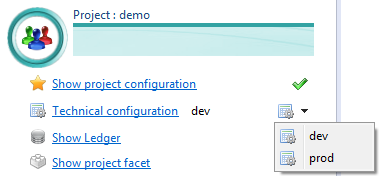
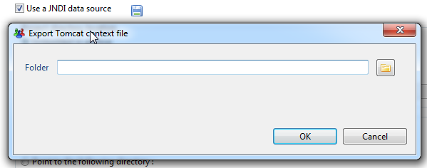
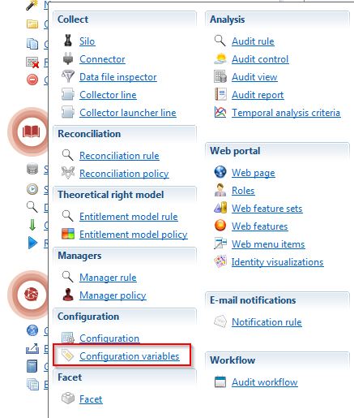

# The technical configuration

## Overview

### Configuration selection

This version makes a clear separation between the project configuration (shared by all technical environments) and many technical configurations (for each platform).

The current technical configuration is now selected from the main menu. A project may have several configurations like DEV, TEST, UAT, PROD,... The name of the current configuration is stored in the local workspace (in metadata). When working in a team using GIT or SVN, the selection of a different configuration by one member does not alter any file in the project.  

### Configuration editor

The configuration is a file with the extension `.configuration` in the new folder `configurations`. Now, when executing batch or running the portal, a configuration must be specified.

Each configuration file contains the following elements:

- Values for project variables. The list of declared variables is still located in the project but the values are defined in each configuration
- Database settings declared as usual (with datasource dialog box) or manually
- Execution plan parameters (useful to test a new reconciliation policy on DEV without changing the execution plan settings for PROD)
- List of silos to include in the execution plan
- Mail server settings
- Web portal configuration which contains what was available in the `config.properties` in the previous version
- War export options
- Workflow settings including calendar and database configuration
- Mail from the batch

### Properties export

The legacy properties files (`datasource.properties`,`mail.properties`,...) may still be used to override some values. This icon lets you save these files with only the values usually overridden like database URL, login, password,...

### JNDI datasource

Now you can use a JNDI datasource. This means that the datasource to access the Identity Analytics database is declared in the Web container (like Tomcat) and not in `datasource.properties`. The icon is used to export a context.xml file to put in `conf/Catalina/localhost` folder inside Tomcat installation directory. Then this file should be renamed with the name of the webapp  

This configuration has the following benefits :

- Possibility to use a connection pool with auto-reconnect feature
- Database configuration is not in the war anymore

### WAR settings

In the previous version, the only way to point to the studio project from the webapp was to edit the web.xml file. Now this is part of the configuration and you can use different options depending on the configuration (DEV, PROD,...)  

### Sandbox name template

The name of the sandox can be changed in the configuration. This name will be used by the studio and the batch. This is a kind of template where the current date can be included. The product provides 6 date formats.  

## Defining custom configuration variables

To allow better customization of the project, configuration variables can be defined in the main project file, under the 'Project' tab, but this is not always convenient, as you might want to keep the variables defined for a specific purpose (the collection of an application, a workflow process, a facet, etc) separate from each other.

To achieve this a dedicated file with extension `.configvariables` that will hold the definitions of your variables. This type of file has to be put in the `/configurations` folder of the project.

To create such a file, simply choose the **Configuration variables** entry in the **New...** option of the main menu:  

You will then access the configuration variables editor, which looks like this:

Each variable has a name, a type, and a display name. Those display names will be used to explain what the variable stands for and what kind of value is expected.
The typical value will be used as a default value if the variables are used to build a facet, otherwise it serves as an example that will be displayed when a value for the variable is prompted.  

**WARNING:** Please bear in mind that the name of the variable has to be unique in the project. It is therefore **strongly** advised to avoid names like the `filename` given in the above example, as it is:

1. Non descriptive
2. Guaranteed to clash with another variable of the same name

A much better name would be for instance `sharepoint_extraction_filename`, and even better : `myvariables_sharepoint_extraction_filename`.
The only exception to this rule is if you use your variables to build a facet, in which case they will automatically be changed at facet installation to avoid conflicting names.

As for the variables defined in the main project file, the variable values will have to be entered in the `Variables` tab of your configuration file(s).
