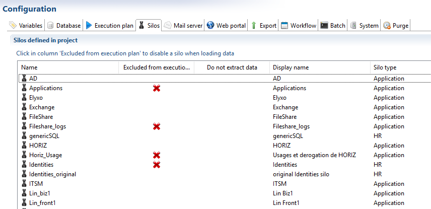

# Silo execution configuration

As the product automatically runs all silos located in the silos folder during the execution plan, an option has been provided to allow the user to select which silos should be ignored. This is convenient if you want to work just on a part of the project configuration for project elaboration and debug purposes. In your production environment it is imperative to systematically perform the loading of all existing data / applications.  

The exhaustive list of silos appears in the technical configuration under the "Silos" tab. In this list, you can click in the column "Exclude from execution plan" to disable a silo when running the execution plan. In a similar manner, if connectors are defined in a Silo (see the corresponding documentation for more information) you can also choose to not extract the data for a specific silo.  

  

The important point to note is that you can define a different set of silos to exclude for each configuration. For example, Exchange silo could be loaded in Dev and not in Prod.  
