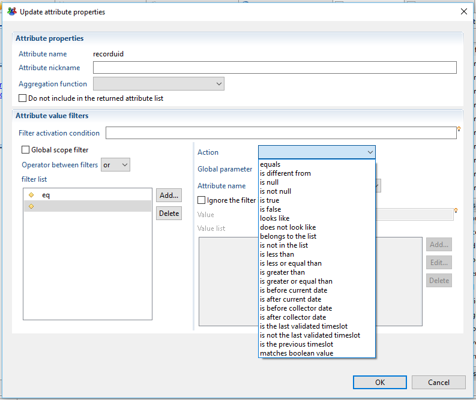
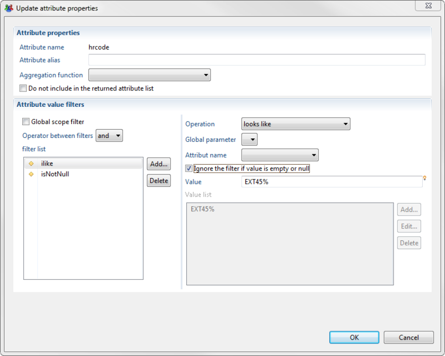
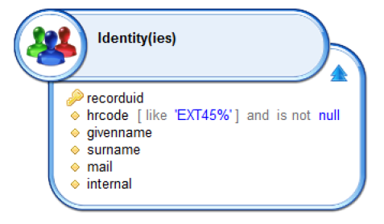
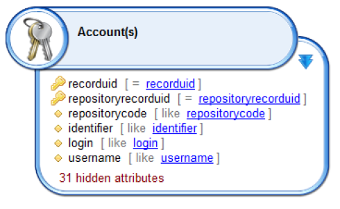
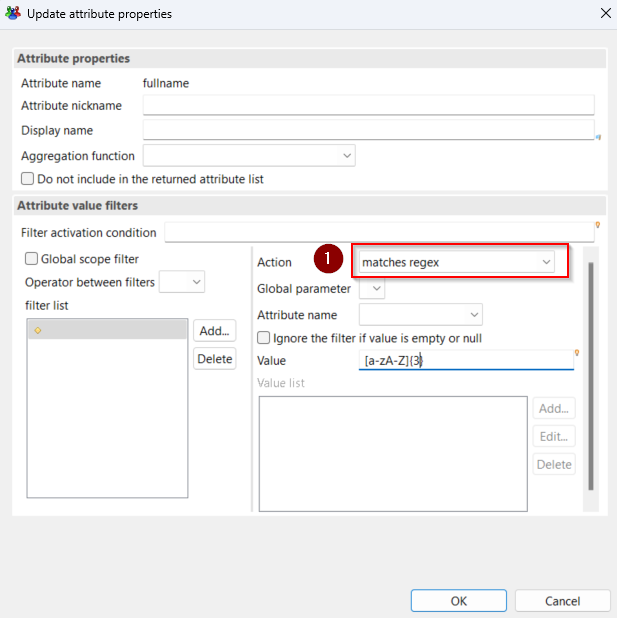

# Filtering Results

## Key Points

It is possible to filter the results returned by an Audit View so as to retrieve only a part of the information contained within the Identity Ledger.  
Two methods are available to filter the results of an Audit View:  

- By applying tests on values or attributes
- By using audit rules

Here, we are concerned with filtering by applying tests on attribute values.  
It is possible to attach a condition to multiple attributes, or to attach multiple conditions to one attribute. The filter function therefore enables the user to carry out a detailed extraction of information contained in the Identity Ledger for analysis or reporting purposes.

## Configuration

Configuration of filters is carried out at the level of your Audit View.  

Open the dialog box for 'Edit Attribute Properties' by right clicking and selecting 'Edit Attribute Properties' or double click on the attribute.  

  

Selecting 'Filter values' enables you to configure the filter to be applied to your attribute. You can add a filter rule by clicking on the button 'Add.' You are then asked to select the test operation to carry out on the attribute, as well as the value or values for comparison.  
The following operations are available:  

- **Equals** : Binary test (corresponding to the '=' operator)
- **Different from** : Binary difference test (corresponding to the '!=' operator)
- **Is null** : Test to see if a value is blank within the attribute
- **Is not null** : Test to see if a value is present within the attribute
- **Is true** : Test to see if a boolean type value is true  
- **Is false** : Test to see if a boolean type value is false
- **Looks like** : A test unique to character strings: tests if the string resembles the string supplied in the configuration. The configuration string can contain wildcards (\_,\*). Character strings are normalised before the test. The test is therefore case insensitive and ignores special characters, accents, etc.
- **Does not look like** : A test unique to character strings: tests if the string does not resemble the string supplied in the configuration. The configuration string can contain wildcards (\_,\*). Character strings are normalised before the test. The test is therefore case insensitive and ignores special characters, accents, etc.
- **Belongs to the list** : Binary test applied to a list of values supplied in the configuration. The attribute value must be present in at least one of the supplied values.
- **Is not in the list** : Binary test applied to a list of values supplied in the configuration. The attribute value may not be present in any of the supplied values.
- **Is less than** : The attribute value must be less than the value supplied in the configuration.
- **Is less than or equal than** : The attribute value must be less than or equal to the value supplied in the configuration.
- **Is greater than** : The attribute value must be more than the value supplied in the configuration.
- **Is greater or equal than** : The attribute value must be more than or equal to the value supplied in the configuration.
- **Is before the current date** : The date type attribute must have a value lower than, or be before, the current date.
- **Is after the current date** : The date type attribute must have a value higher than, or be after, the current date.
- **Is before the collector date** : The date type attribute must have a value lower than the date, or be before, at which the execution plan was launched.
- **Is after the collector date** : The date type attribute must have a value higher than the date, or be after, at which the execution plan was launched.
- **Is the last validated timeslot** : The attribute value must be equal to the last validated timeslot UID
- **Is not the last validated timeslot** : The attribute value must be different than the last validated timeslot UID
- **is the previous timeslot** : The attribute value must be equal to the previous timeslot UID.  
- **matches boolean value** : The attribute must be equal to a specified boolean value  

The comparison test can be carried out on static values or on values contained in the Audit View configuration. Depending on the process of the test selected, the static value is contained either in the 'Value' field or in the 'Value List' field.

> If tests are carried out on 'date' type attributes, the search parameters must match the date format of the search output.
> In the case of a static parameter, the format must be '_yyyyMMddhhmmss_', e.g., 20110801153000 for 1 August 2011 at 11:53:00.

> The data entry assistant is available for static values. Click on the little yellow light bulb or use the keyboard shortcut 'Ctrl+Space' for access to a list of valid entries for this attribute in your Identity Ledger.  

It is possible to apply multiple conditions consecutively to a single attribute, meaning that you can configure the compositor to apply to all conditions:  

- **or** : At least one condition must apply
- **and** : All the conditions must apply  

  

Once the configuration is complete, this appears in the Audit View Editor showing the combined operations carried out on the attribute. The short names for the filter operations are used:  

- **=**: equal to
- **\<\>** : different from
- **is null**
- **is not null**
- **like**
- **not like**
- **is true**
- **is false**
- **in** : is included in the list
- **not in** : is not included in the list
- **\<:** less than
- **\<=:** less than or equal to
- **\>** : more than
- **\>=** : more than or equal to
- **before now/commit date/current validated timeslot**
- **after now/commit date/current validated timeslot**
- **is previous timeslot**
-  matches the boolean value  

  

Where a filter operation is configured for several attributes, all filter operations must apply to avoid the result line being filtered out (with an 'AND' operation between the filter operations).  

  

> To apply advanced filters, you can also configure an Audit Rule and use it from the Audit View.

## Regular expressions

It is possible to filter using regular expressions.  

Please note that due to limitations in SQL server only the following patterns are supported.

- Expression `.*`: multi character wildcard
- Expression `.+`: multi character wildcard
- Expression `.`: single character wildcard
- Expression `^`: represents the start of the string
- Expression `$`: represents the end of the string
- Expression `[string]{3}`: Repetition of the string in brackets
- Expression `a{10}`: Repetition of a single character
