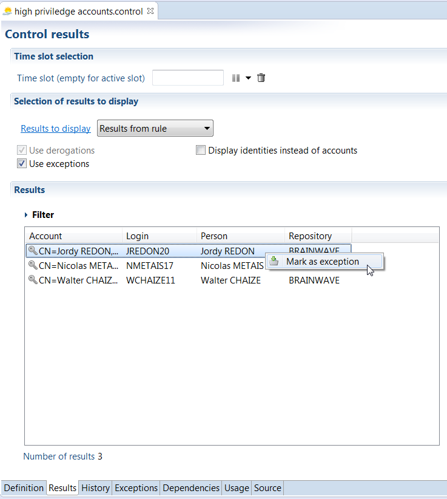
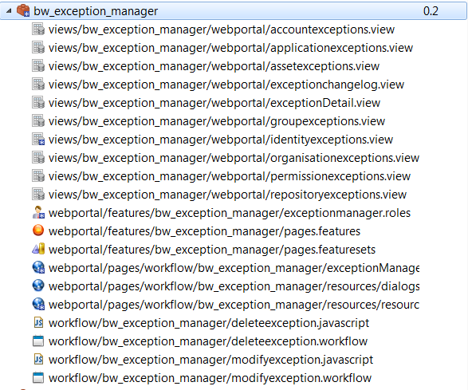
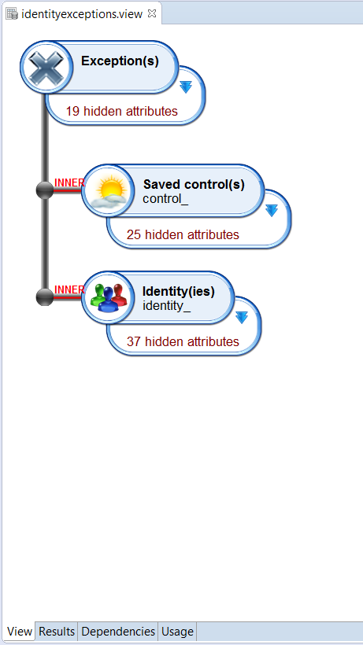
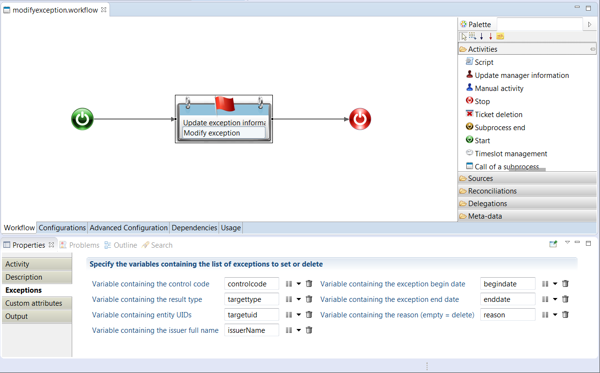
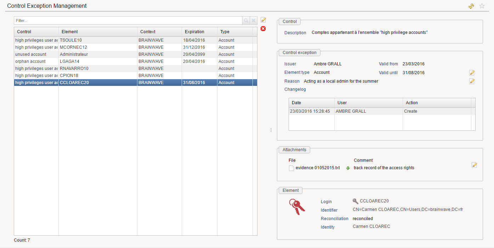
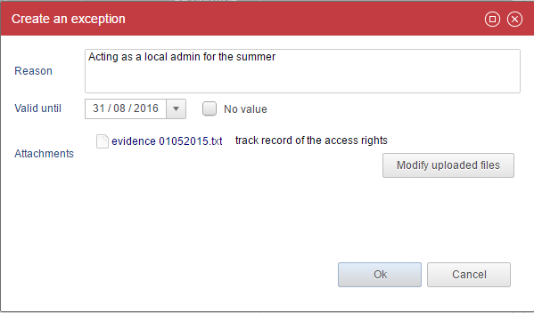
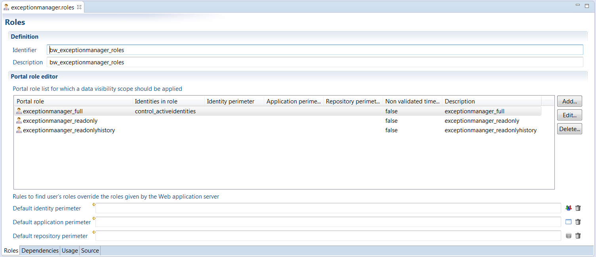

# Exception management

Exception management is a powerful feature that allows you to manage the lifecycle of a control defect. As of version 2016 of Identity Analytics platform the feature has been enhanced with the possibility to manage exception through workflows.  
Exceptions are used to attach a lifecycle information to a control result when:  

- The control defect is a false positive,
- There is a reason for the control defect either temporary or definitive,

For example, following a situation requiring a definitive:  
In some of the company's countries, teams are too small to distribute tasks and some of the people have no choice but to cumulate duties that have to be segregated such as create payments and validate them. An exception will be linked to that segregation of duties control in the involved countries with a permanent effect.  

Another example requiring a temporary reason:  
A person is going to move to other responsibilities, in the meantime this person has to cumulate some incompatible duties in order to manage the transition period smoothly. For instance this person could manage on one hand goods receipt, on the other invoices validation during the next month, until his successor is fully operational. An exception will be linked to that segregation of duties control for this person, effective during the one month transition period.

> The exception feature does not remove the control results. It adds additional information that can be linked to it.
> You can then choose how to display this information to end-users through the portal.
> For instance hide results with controls defects, or to display them in another format and/or with additional information (the control defect reason, start and end date...) etc.

From a technical point of view, exceptions are compatible with all control families except "theoretical rights" where a [derogation](../collector/04-components/target#derogation-target) should be used instead.  
Exception can be managed in two different ways:  

- directly from the studio of Identity Analytics:  

  

- or through workflow activities, where end users are able to interact and define new exceptions through the web portal:  

  

## Add-ons

Some examples of views, pages and workflows definitions are available in the facet [on the marketplace](https://marketplace.brainwavegrc.com/package/bw_exception_manager/):  

  

## Exception configuration

### Views

Exceptions are not taken into account automatically since they require additional information linked to control results.  
So to list exceptions, a new object has been included in the views:  

  

Some examples of views including exception are available in the `Exception manager` facet.  
The views can then be found in the folder: `views\bw_exception_manager\webportal`.  

### Workflows

During a workflow it is possible to add, modify or delete an exception. Through a workflow, the following variables are available:  

- control code
- result type: must be set to 1  
- entity UIDs: target UIDs (accounts, identities, application...)  
- issuer fullname: name of the person who declares the exception  
- exception begin date
- exception end date
- reason (empty = delete)  

  

Some example workflows are available in the `Exception manager` facet in the folder: `\workflow\bw_exception_manager`.  

### Pages

To allow the end user to define exceptions during a workflow, corresponding pages have to be developed. Please see the relative documentation for more information on pages.  
The `Exception manager` facet comes with predefined pages that allow exception management in the project perimeter. This is performed through a dedicated Control Exception Management dashboard:  

  

Within this dashboard it is possible to Add, Modify or delete exceptions.  



These pages are available in the `Exception manager` facet in the folder: `\webportal\pages\workflow\bw_exception_manager`.  

Using the pages language, if you want to consolidate in a single dataset information about the defects and the exceptions for a given control, you need to join two datasets as in the following example:  

```page
accounts = Dataset {
    view:allaccountdefectdetails with selectedPolicy to controlcode
}
exceptions = Dataset {
    view:allaccountexceptiondetails with selectedPolicy to controlcode
}

accountsWithExcep = Dataset {
    join:Join {
        primary-dataset:accounts
        primary-column:uid
        primary-optional:False
        secondary-dataset:exceptions
        secondary-column:accountuid
        secondary-cardinality:optional
        secondary-prefix:exception
    }  
}
```

In addition, a dedicated dialog page is available in the facet in order to help you rapidly define interactive dashboards. Three new actions are defined in this page allowing you to add buttons to delete, modify and create exceptions as in the following example:  

  

This page is also provided in the `Exception manager` facet in: `\webportal\pages\workflow\bw_exception_manager\resources`.  

Here are the entries added into the associated .page file:  

```page
/* Import exception facet pages */
import "/webportal/pages/workflow/bw_exception_manager/resources/resources.page"
import "/webportal/pages/workflow/bw_exception_manager/resources/dialogs.page"


/*    Dialog createControlExceptionDialog
 *
 *  Parameters:
 *  - controlcode (String)
 *  - controlresulttype (Integer)
 *  - targetuid (String) uid of the element of the exception
 *  Output:
 *  - resultaction (Integer) 0-> Modified 1-> Canceled. Indicate which button was clicked.
 *
 *  NLS in $controlexception.add.*
 */
            Button {
                text: "Create an exception"
                actions: Dialog createControlExceptionDialog ( selectedControlCode to controlcode, selectedIdentityUid to targetuid, 1 to controlresulttype ), Flash Information Concat("Exception creation: ", result), ReloadData(exception, peoplesoddiscrepancies_with_exception)
                disabled: OrPredicate {
                    StringPredicate( selectedException ) { when "Exception" then True otherwise False}
                    StringPredicate( selectedControlCode  )  { when IsEmpty then True otherwise False}
                }
            }

/*    Dialog modifyControlExceptionDialog
 *
 *  Parameters:
 *  - exceptionuid (String)
 *  - targetuid (String) uid of the element of the exception
 *  Output:
 *  - resultaction (Integer) 0-> Modified 1-> Canceled. Indicate which button was clicked.
 *
 *  NLS in $controlexception.modify.*
 */
            Button {
                text: "Modify the exception"
                actions: Dialog modifyControlExceptionDialog ( selectedExceptionUid to exceptionuid, selectedIdentityUid to targetuid ), Flash Information Concat("Exception creation: ", result), ReloadData(exception, peoplesoddiscrepancies_with_exception)
                disabled: Not AndPredicate {
                    StringPredicate( selectedException ) { when "Exception" then True otherwise False}
                    StringPredicate( selectedControlCode  )  { when IsEmpty then False otherwise True}
                }
            }


/*    Dialog deleteControlExceptionDialog
 *
 *  Parameters:
 *  - controlcode (String)
 *  - controlresulttype (Integer)
 *  - targetuid (String) uid of the element of the exception
 *  Output:
 *  - resultaction (Integer) 0-> Deleted 1-> Canceled. Indicate which button was clicked.
 *
 *  NLS in $controlexception.delete.*
 */
             Button {
                text: "Delete the exception"
                actions: Dialog deleteControlExceptionDialog ( selectedControlCode to controlcode, selectedIdentityUid to targetuid, 1 to controlresulttype ), Flash Information Concat("Exception creation: ", result), ReloadData(exception, peoplesoddiscrepancies_with_exception)
                disabled: Not AndPredicate {
                    StringPredicate( selectedException ) { when "Exception" then True otherwise False}
                    StringPredicate( selectedControlCode  )  { when IsEmpty then False otherwise True}
                }
            }
```

## Role, Features and Featuresets

User management has also been included to incorporate exceptions. The role allows you to determine who is given access to determined Featuresets, Featureset being a list of Features and Features correspond to an action.  
In the `Exception manager` facet, three Features are available. You can associate these to the pre-defined roles in your project (please see the corresponding documentation on Roles, Feature and Featuresets for more information):  

- fullcontrol: which allows to read all the exceptions defined but also to create, modify or delete them.
- readonly: which allows to read all the exceptions defined only.
- readhistory: which allows to read all the exceptions defined and also to view the administration logs: who has created the exception, when etc.

### Setting up Features

The following caption provides an example on how to setup features and to which featureset they should be included:  

  

### Setting up Featuresets

The following caption shows an example on how to setup Featuresets. Including which roles can use the corresponding Featureset:  

  

### Setting up roles

The following caption provides an example of how to setup the roles in the webportal:  

  
