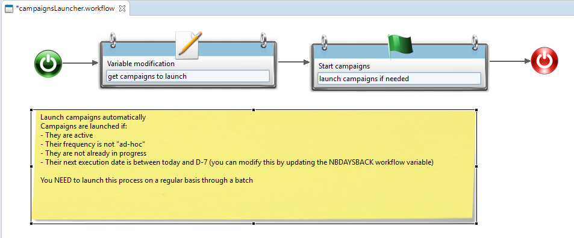

# Running Campaigns

A campaign is used to involve people from different organizations on a particular goal which has several steps, and are executed in a certain order.  
For example, the entitlement review is a campaign which is launched every 6 month to ask each business manager if the access rights of his team members are still relevant.  

The output of this campaign is a list of actions to perform (keep, revoke or update) on all access rights. The campaign may continue with application managers to apply the changes in the systems. This is the remediation step.  

A campaign can be monitored to look at the partial results at any time and check if the objective will be reached on ti

The difference between a campaign and a process is that a campaign is usually repeated on a regular basis. The campaigns are often launched before an annual or semestrial audit. The campaign definition contains both the review perimeter and the launch frequency.  

How does it work in Identity Analytics product ? There are 3 ways to run campaigns:  

- Manually, in the campaign manager
- Automatically, using a command line to start one specific campaign if conditions are met
- Automatically, using a workflow which can check all campaigns and launch them if conditions are met.

## Running a campaign using the campaign manager  

Through the campaign manager, you define a new campaign with a code (which is used as an identifier), a start date and a frequency. Your new campaign exists but is not launched. You can select the campaign and launch it. It will use all the parameters defined during the campaign creation.  

  

## Running a campaign using the command line

A command line called campaign.cmd or campaign.sh is provided in the installation directory. This batch is used to check if the campaign can be launched. If yes, the batch launch the campaign. If no, the batch exits without doing anything else. The conditions checked by the batch are the following ones:  

- the campaign code exists
- the campaign is active
- the next execution date is now or in the past
- the campaign is not currently running (explained below)

For each campaign defined using the campaign manager, only one process can run. For example, an entitlement review campaign defines when and how to review entitlements. If you run the campaign, a workflow process is launched and the next execution date is updated according to the frequency defined for this campaign. If the process is very long and the next execution date is reached, a new campaign can NOT start because the previous one took too much time and is still running. The product allows only one campaign instance at the same time.  

The command usage is given below:  

```sh
igrc_campaign <project name> <config directory path> <config name> <campaign code> [FORCE] [DEBUG]
```  

Project name, config directory and config name are the usual parameters expected by all the igrc commands. The campaign code is the identifier given upon campaign creation. The campaign designated by campaign code is launched if the conditions described above are met.  

The FORCE option is used to bypass the the check of the active flag and the check of the next execution date. It allows a campaign to be run before its official next execution date. The check of active flag is also bypassed to be able to start manually a campaign that has been disabled in the campaign manager. This campaign is ignored but you can force an execution with this option. To sum up, the conditions checked in FORCE mode are the following ones:  

- the campaign code exists
- the campaign is not currently running (explained below)

The `igrc_campaign.[cmd|sh]` command can be used to launch automatically the campaign by calling it each night using Cron on Linux or Task scheduler on Windows. In this mode, do NOT use the FORCE option. The batch will check if it is time to run a new campaign respecting the frequency defined in the campaign definition.

## Running a campaign using a workflow

The command line explained above is used to run a specific campaign. But if you have several campaigns and want to launch them as on a regular basis, it is better to use a workflow as a kick starter.  
In this workflow, you can use a view to retrieve the campaigns and launch the ones corresponding to your business criteria. This is the way to go if you have more conditions to met than the 4 conditions described above.  

This workflow can be run using the `igrc_workflow.[cmd|sh]` command and it can be scheduled to in Cron or Task scheduler to run each night. This workflow does NOT launch campaigns each time it is run. Its objective is to check if the conditions are met to launch a campaign, if yes, the campaign is launched and the next execution date is updated in the database. So the next day, when this same workflow run again, it will do nothing as the campaign is already running and the next execution date is still in the future.  

The campaign manager facet is delivered with such a workflow to launch the campaigns. It is called campaignsLauncher.workflow.  

  

This is a template to change. You must add your business conditions to decide whether a particular campaign has to be launched. It can be customize in many ways. Here are some ideas:  

- The view can be changed to filter campaigns,
- A manual task can be added before launch so that an actor can approve the launch,
- An e-mail could be sent prior to the campaign as a teaser to announce the next campaign.
