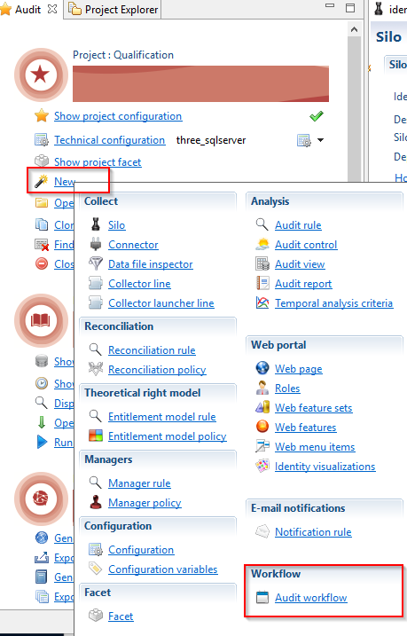
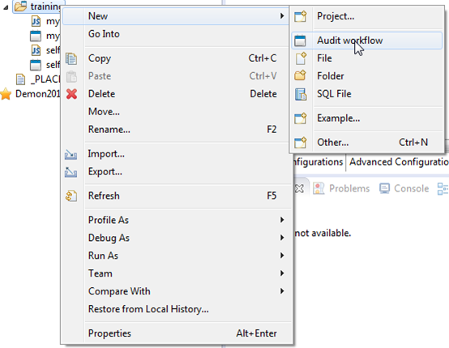
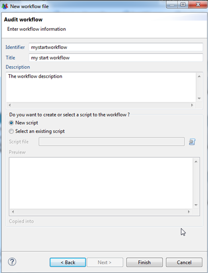

# Workflow

## General principles

### Prerequisites and dependencies

The workflow engine is available for Versions 2014 and above.  

In order to run a workflow it is required to have a valid license with the workflow component activated. It is also necessary to configure a separate database that will include all workflow parameters and variables used by ACTIVITI (the underlying workflow engine). Please see the following Documentation for more information on configuring the ACTIVITI database. As it is the case for the product the only databases supported are SQL server, Oracle and Postgres.  

Finally, before implementing a workflow it is necessary to first install the task manager facet. This is necessary for you to be able to manage, monitor and troubleshoot all workflow process instances in the webportal.  

### Presentation

A Workflow within Identity Analytics refers to a defined series of actions or tasks that are to be performed once a process is initiated. These can be for example the review or remediation processes: "Access remediation" and "Access request".  

The workflow engine is implemented as a BPMN 2.0 compliant and uses the Activiti open-source engine ([http://www.activiti.org/](http://www.activiti.org/)). As explained before it requires a separate database to store it's data. Please refer to corresponding documentation on how to configure your database.  

Designing a workflow is done through Identity Analytics  back-office. It produces workflow definition files which are part of the project (for example "Application Review" ). Once the project is published on the Web Portal, users may start instances of these workflow definitions (for example an instance of "Application Review" on "SAP" and another instance on SharePoint ).  

There are three kinds of user interface in the portal regarding workflows:  

- pages to list the tasks available for users
- pages which are part of the workflow ( usually one page per activity )
- pages to monitor workflow as a workflow manager or as an administrator  
At design time, you have to build pages for all manual activities in the workflow. This includes also the first page which is used to launch a workflow ( the Start activity ).

> A workflow process begins and finishes with the same timeslot.

### Instance & definition

Workflows include concepts that you might know from object oriented programming. The .workflow file is a workflow definition (for example "Application Review" ). It contains the variables and set of tasks, and should cover the workflow's behavior for all possible variable values. This is similar to an object definition (class).  

When you launch a workflow in the portal (or in debug mode in the studio), you create an instance of the workflow (for example an instance of "Application Review" on "SAP" and another instance on SharePoint ). Multiple instances can run in parallel: each one having it's own variable values, and might behave differently. This is similar to an object instance (new ()).  

### Workflow creation

To create a new workflow you have two options:  

- From the audit menu: New \> Audit workflow  

  

- From a project explorer:  right click the "workflow" folder and navigate to New \> "Audit workflow"  

  

Fill in the displayname, identifier and title of your new workflow, as well as a description. You have to select to create of a new script or use an existing script. This file will contain the javascipt expressions and can be changed later on in the advanced configuration tab of your created workflow.  

All created Workflows are located under the folder "/workflow" will have a ".workflow" extension.  

  
