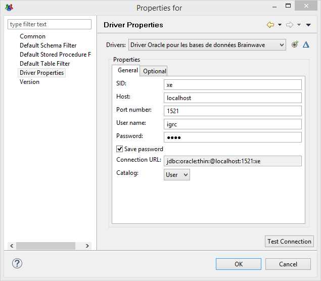
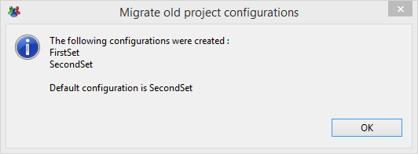
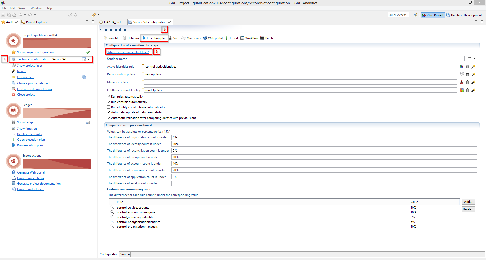
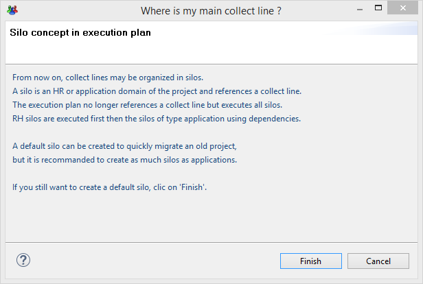
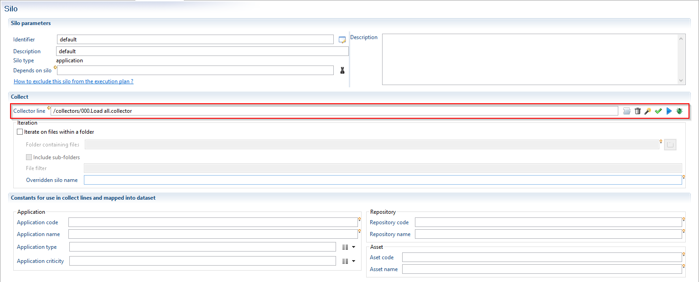

# How-To Perform a Project Migration

Migrating an existing project from previous version of iGRC analytics is possible and relatively straight forward. It is reminded that only migrating your project will not allow you to use the latest capabilities of iGRC such as [Silos](../igrc-platform/silos/index.md) and the latest [Pages](../igrc-platform/pages/index.md) in the webportal. During the following steps you will perform the following actions:

> 1. Copy the existing files into the new workspace
> 2. Automatically create the configuration files
> 3. Update the database schema
> 4. Create the default Silo (optional and only when upgrading from a 2014 or previous version)  

Before migrating your project it is **recommended** to **backup** your iGRC database!

## Prerequisites

## Compatibility matrix

This process is valid as of version 2015

## Procedure

### Import the project into your workspace

To import a project, navigate to the menu "File /> Import" , this will open a new window where you can choose the format of the project to import:

Under the General folder select the "Existing Projects into Workspace"  option and click "Next".

It is possible to import an archive file of the project, however if you chose to do this the archive should be created by exporting a project in the previous version of iGRC (under the menu: "File \> Export").

In the new window in which you should perform the following steps :

> 1. Browse to where the previous project existed
> 2. Check that the project is correctly selected
> 3. Check the "Copy projects into workspace"  box
> 4. Click "Finish"

### Technical configuration and database schema upgrade

Once the project imported into the new workspace, it is necessary to create the new configuration files, update the database and create the default silo.

To import your previous configuration, click small black arrowhead to the right of "Technical configuration". This will open a new window asking you if you want the create a configuration based on the previous configuration files. Click "Yes".

A second prompt will ask you if you want to automatically declare the database. Again click "Yes".

Under "Driver Properties" you will have to re-type your password in order to connect to the database. It is recommended to test the connection before clicking "OK".  

Finally, when upgrading from a version 2014 and bellow, a window will detail the configurations created. Two in my case FirstSet and SecondSet. The default configuration in my case is SecondSet. You can find more information about the new configuration features [here]({{site.baseurl}}).

Open the active technical configuration window by clicking the link "Technical configuration"  and navigate to the "Database how-to's" tab. iGRC will automatically detect the version of the database schema and signal you to update it. For that you just need to click the "Upgrade database schema"  hyperlink. You will be prompted to confirm the schema upgrade.

By navigating to "Show Timeslots"  you should be able to see a list of you previous timeslots and their status. The column Product version is a new feature that is incompatible with timeslots performed on previous versions of the product and is therefore empty. This column will be filled form now on.

### Default Silo

In version 2016 and above, you must define silos (for example one per application) and run the collect so that each data stored in the Identity Analytics database (account, group, permission,...) belong to a silo. You will find more information about Silos in the Identity Analytics Wiki ([Silos](../igrc-platform/silos/index.md).  

When upgrading from a version 2014 or bellow, It is possible to create a default Silo that runs your main collect line without taking the new feature into account. To do this under the "Technical configuration"  page open the "Execution plan"  tab and click on the hyperlink "Where is my main collect line".

The following window will open detailing the limitations of the Default Silo in the new version of the product. Click "Finish"

Your collector line is now defined in the automatically generated Silo.

The migration of your project is now complete.
